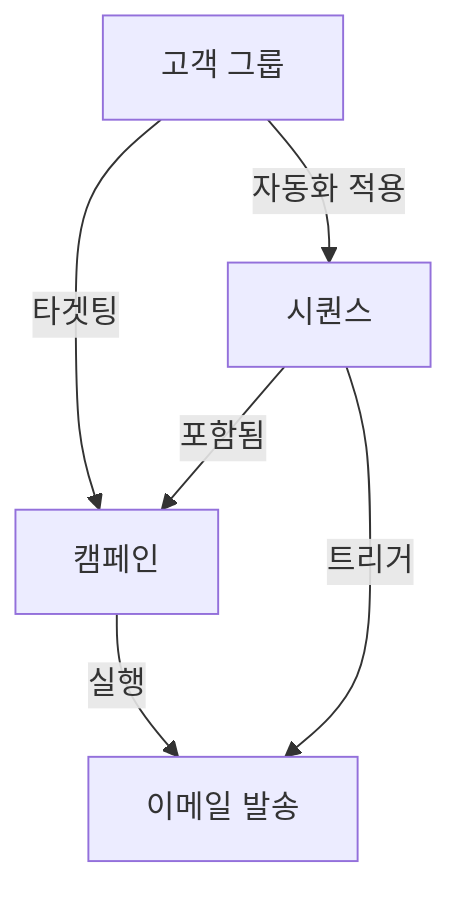
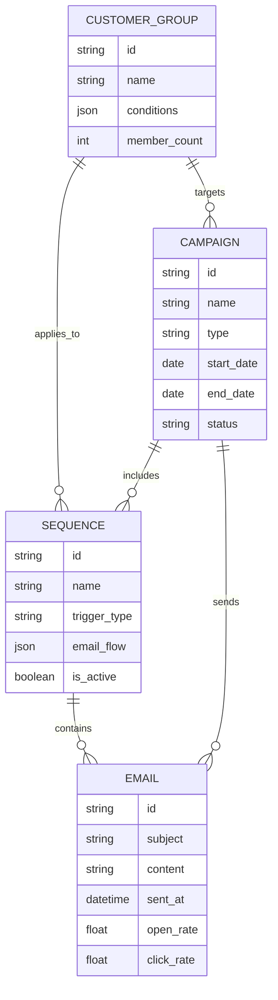

# 캠페인, 시퀀스, 고객 그룹의 관계 구조

## 📋 개요

이메일 마케팅 자동화 시스템에서 **캠페인**, **시퀀스**, **고객 그룹**은 서로 긴밀하게 연결되어 효과적인 마케팅 전략을 구현합니다.



---

## 🎯 1. 고객 그룹 (Customer Groups)

### 정의
고객을 특정 기준에 따라 세분화한 집합

### 주요 특징
- **동적 세그먼테이션**: 조건에 따라 자동으로 고객이 추가/제거됨
- **다중 조건 설정**: 구매 이력, 행동 패턴, 인구 통계 등 복합 조건
- **실시간 업데이트**: 고객 활동에 따라 그룹 멤버십 자동 갱신

### 예시
```yaml
VIP 고객 그룹:
  조건:
    - 최근 3개월 내 구매 금액 > 100만원
    - 이메일 오픈율 > 60%
    - 구매 횟수 >= 3회

신규 가입자 그룹:
  조건:
    - 가입일 < 30일
    - 첫 구매 여부 = 미구매

휴면 고객 그룹:
  조건:
    - 마지막 활동 > 90일
    - 이메일 오픈 = 0 (최근 30일)
```

---

## 📧 2. 시퀀스 (Sequences)

### 정의
미리 정의된 규칙에 따라 자동으로 실행되는 이메일 시리즈

### 주요 특징
- **트리거 기반**: 특정 이벤트나 조건 충족 시 자동 시작
- **시간 간격 설정**: 각 이메일 간 대기 시간 설정
- **조건부 분기**: 고객 반응에 따른 경로 분화
- **자동 중단**: 목표 달성 시 시퀀스 자동 종료

### 시퀀스 유형

#### 1) 온보딩 시퀀스
```yaml
트리거: 신규 가입
이메일 구성:
  1. Day 0: 환영 이메일
  2. Day 3: 주요 기능 소개
  3. Day 7: 사용 팁 & 트릭
  4. Day 14: 첫 구매 할인 오퍼
중단 조건: 첫 구매 완료
```

#### 2) 재구매 유도 시퀀스
```yaml
트리거: 구매 후 30일 경과
이메일 구성:
  1. Day 30: 제품 만족도 조사
  2. Day 35: 관련 상품 추천
  3. Day 40: 재구매 할인 쿠폰
중단 조건: 재구매 완료
```

#### 3) 장바구니 이탈 시퀀스
```yaml
트리거: 장바구니 담기 후 24시간 미구매
이메일 구성:
  1. Hour 24: 장바구니 리마인더
  2. Day 3: 10% 할인 제공
  3. Day 7: 마지막 기회 알림
중단 조건: 구매 완료
```

---

## 🚀 3. 캠페인 (Campaigns)

### 정의
특정 마케팅 목표를 달성하기 위한 이메일 마케팅 활동의 집합

### 캠페인 유형

#### 1) 단일 이메일 캠페인
- 일회성 대량 발송
- 예: 블랙프라이데이 프로모션, 신제품 출시

#### 2) 시퀀스 기반 캠페인
- 여러 시퀀스를 포함하는 장기 캠페인
- 예: 연말 프로모션 (다양한 고객 그룹별 시퀀스 운영)

#### 3) AI 최적화 캠페인
- 머신러닝을 통한 자동 최적화
- 발송 시간, 제목, 콘텐츠 개인화

---

## 🔗 4. 상호 관계 및 워크플로우

### 관계 다이어그램



### 실제 워크플로우 예시

#### 예시 1: 신규 고객 전환 캠페인

```yaml
캠페인: "2024 신규 고객 전환"
기간: 2024.10.01 - 2024.12.31

타겟 그룹:
  - 신규 가입자 그룹

포함 시퀀스:
  1. 온보딩 시퀀스 (자동 적용)
  2. 첫 구매 유도 시퀀스 (온보딩 완료 후)
  3. 로열티 프로그램 안내 (첫 구매 완료 후)

성공 지표:
  - 신규 가입자 → 첫 구매 전환율 > 15%
  - 평균 구매 금액 > 50,000원
```

#### 예시 2: VIP 고객 유지 캠페인

```yaml
캠페인: "VIP 고객 리텐션"
기간: 상시 운영

타겟 그룹:
  - VIP 고객 그룹

포함 시퀀스:
  1. VIP 혜택 안내 (매월 1일)
  2. 조기 액세스 알림 (신제품 출시 시)
  3. 생일 축하 시퀀스 (생일 7일 전)
  4. 구매 감사 시퀀스 (구매 직후)

성공 지표:
  - VIP 이탈률 < 5%
  - 평균 구매 주기 < 30일
```

---

## 📊 5. 성과 측정 및 최적화

### 핵심 성과 지표 (KPIs)

#### 고객 그룹 레벨
- 그룹 성장률
- 평균 생애 가치 (LTV)
- 그룹 간 이동률

#### 시퀀스 레벨
- 완료율
- 각 단계별 이탈률
- 평균 완료 시간
- 전환율

#### 캠페인 레벨
- 전체 도달률
- 평균 오픈율
- 평균 클릭률
- ROI (투자 대비 수익)
- 목표 달성률

### 최적화 전략

```yaml
A/B 테스트:
  - 제목 라인
  - 발송 시간
  - 콘텐츠 형식
  - CTA 버튼

자동 최적화:
  - 머신러닝 기반 발송 시간 최적화
  - 개인화된 콘텐츠 추천
  - 동적 세그먼테이션

피드백 루프:
  - 고객 반응 분석
  - 시퀀스 경로 조정
  - 그룹 조건 재정의
```

---

## 🔄 6. 실행 사이클

### 1단계: 고객 그룹 정의
- 비즈니스 목표에 따른 세그먼테이션
- 데이터 기반 조건 설정
- 그룹 크기 및 특성 분석

### 2단계: 시퀀스 설계
- 각 그룹별 커뮤니케이션 전략 수립
- 이메일 콘텐츠 및 타이밍 계획
- 트리거 및 중단 조건 설정

### 3단계: 캠페인 구성
- 전체 마케팅 목표 설정
- 그룹과 시퀀스 매핑
- 일정 및 예산 계획

### 4단계: 실행 및 모니터링
- 캠페인 런칭
- 실시간 성과 추적
- 이슈 대응

### 5단계: 분석 및 개선
- 성과 데이터 분석
- 인사이트 도출
- 다음 캠페인 개선사항 적용

---

## 💡 7. 베스트 프랙티스

### 고객 그룹 관리
1. **과도한 세분화 지양**: 관리 가능한 수준으로 그룹 수 제한
2. **정기적 검토**: 월 1회 그룹 조건 및 성과 검토
3. **중복 최소화**: 그룹 간 중복을 최소화하여 명확한 타겟팅

### 시퀀스 설계
1. **가치 제공 우선**: 각 이메일이 고객에게 가치를 제공하도록 설계
2. **적정 빈도 유지**: 과도한 이메일로 피로감 유발 방지
3. **명확한 CTA**: 각 이메일에 명확한 행동 유도

### 캠페인 운영
1. **통합적 접근**: 모든 채널과 일관된 메시지 전달
2. **데이터 기반 의사결정**: 직관보다 데이터에 기반한 전략 수립
3. **지속적 테스트**: 끊임없는 A/B 테스트로 개선점 발견

---

## 🎯 8. 활용 시나리오

### 시나리오 1: 계절 프로모션
```
고객 그룹: 전체 활성 고객
캠페인: 여름 세일
시퀀스:
  - 사전 예고 (D-7)
  - 세일 시작 (D-Day)
  - 리마인더 (D+3)
  - 마지막 기회 (D+6)
```

### 시나리오 2: 제품 출시
```
고객 그룹:
  - VIP 고객 (조기 액세스)
  - 관심 고객 (일반 출시)
  - 잠재 고객 (프로모션)
캠페인: 신제품 런칭
시퀀스: 각 그룹별 맞춤형 시퀀스
```

### 시나리오 3: 고객 재활성화
```
고객 그룹: 휴면 고객
캠페인: Win-back
시퀀스:
  - 그리워요 메시지
  - 특별 할인 제공
  - 계정 삭제 예고
```

---

## 📈 9. 성공 사례

### 사례 1: E-commerce A사
- **상황**: 장바구니 이탈률 70%
- **전략**:
  - 고객 그룹: 장바구니 이탈 고객
  - 시퀀스: 3단계 리마인더 + 할인
- **결과**: 이탈률 45%로 감소, 매출 25% 증가

### 사례 2: SaaS B사
- **상황**: 신규 가입자 이탈률 60%
- **전략**:
  - 고객 그룹: 신규 가입자
  - 시퀀스: 14일 온보딩 프로그램
- **결과**: 30일 리텐션 40% → 65% 개선

### 사례 3: 교육 플랫폼 C사
- **상황**: 수강 완료율 30%
- **전략**:
  - 고객 그룹: 진도율별 세분화
  - 시퀀스: 맞춤형 동기부여 메시지
- **결과**: 완료율 30% → 52% 상승

---

## 🔮 10. 미래 전망

### AI/ML 통합
- 예측적 세그먼테이션
- 자동 시퀀스 생성
- 실시간 콘텐츠 최적화

### 옴니채널 확장
- 이메일 + SMS + 푸시 통합
- 채널 간 일관된 경험
- 크로스 채널 시퀀스

### 하이퍼 개인화
- 1:1 개인화 캠페인
- 실시간 행동 기반 조정
- 컨텍스트 인식 메시징

---

## 📚 참고 자료

- [SendGrid 공식 문서](https://docs.sendgrid.com/)
- [이메일 마케팅 베스트 프랙티스](https://www.campaignmonitor.com/resources/)
- [마케팅 자동화 가이드](https://www.hubspot.com/marketing-automation)

---

*이 문서는 Send Grinda 이메일 마케팅 자동화 시스템의 핵심 구성 요소인 캠페인, 시퀀스, 고객 그룹의 관계를 설명합니다. 지속적으로 업데이트되며, 실제 운영 경험을 바탕으로 개선됩니다.*