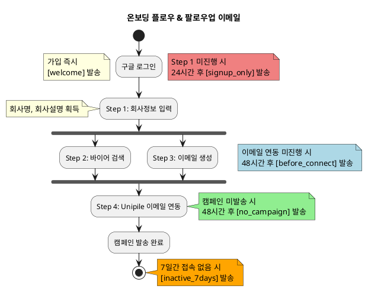

# 팔로우업 이메일 시나리오

## 사용자 여정 흐름도

```
구글 로그인 ─────────────────────────► [welcome] 즉시 발송
    │
    ├─ 24시간 방치 ──────────────────► [signup_only] 발송
    │
    ▼
Step 1: 회사정보 입력
    │
    ▼ (자동 실행)
Step 2+3: 바이어 검색 & 이메일 생성 (병렬)
    │
    ├─ 48시간 방치 ──────────────────► [before_connect] 발송
    │
    ▼
Step 4: Unipile 이메일 연동
    │
    ├─ 48시간 방치 ──────────────────► [no_campaign] 발송
    │
    ▼
캠페인 발송 완료

────────────────────────────────────
7일간 접속 없음 ──────────────────► [inactive_7days] 발송
```

## 이메일 타입 요약

| 타입 | 발송 조건 | 발송 시점 | 개인화 변수 |
|------|----------|----------|-------------|
| `welcome` | 구글 로그인 가입 완료 | 즉시 | `name`, `managerName`, `kakaoLink`, `phoneNumber` |
| `signup_only` | 구글 로그인 후 Step 1 미진행 | 24시간 후 | `name` |
| `before_connect` | 자동생성 완료 후 Unipile 연동 미진행 | 48시간 후 | `name`, `companyName` |
| `no_campaign` | Unipile 연동 완료 후 캠페인 미발송 | 48시간 후 | `name`, `companyName` |
| `inactive_7days` | 7일간 접속 없음 | 7일 후 | `name` |

## PlantUML 다이어그램



---

## 이메일 템플릿 예제

### 0. welcome - 환영 이메일

**발송 조건**: 구글 로그인 가입 완료 시 즉시 발송

**제목**: `${name} 대표님, RINDA에 오신 걸 환영합니다!`

**본문**:
```
${name} 대표님, 안녕하세요.

RINDA에 가입해주셔서 정말 감사합니다.

저는 대표님의 해외수출을 함께 할 ${managerName}입니다.
15년간 중소기업 해외영업 현장에서 일했고, 지금은 RINDA에서 대표님 같은 분들을 돕고 있습니다.

솔직히 말씀드리면, 처음 RINDA 쓰시는 분들 중에 "이거 어디서부터 시작하지?" 하시는 분이 많으세요.

괜찮습니다. 저도 처음엔 그랬거든요.

혹시 지금 막히는 부분 있으시면 편하신 방법으로 언제든 연락주세요.

제 카톡: ${kakaoLink} (보통 여기가 제일 빨라요)
제 번호: ${phoneNumber} (통화 편하시면 바로 전화주세요)

아니면 이메일 답장하셔도 됩니다. 보통 1시간 안에 답드려요.

대표님 제품이 해외에서 잘되시도록 제가 최선을 다해 돕겠습니다.

${managerName}
RINDA 고객성공팀
```

---

### 1. signup_only - 구글 로그인만 하고 이탈

**발송 조건**: 구글 로그인 후 Step 1(회사정보 입력) 미진행 시, 24시간 후 발송

**제목**: `${name} 대표님, 귀사를 찾는 150곳의 바이어를 아직 못 보셨나요?`

**본문**:
```
${name} 대표님, 안녕하세요.

어제 RINDA에 가입해주셨는데
아직 시작을 안 하신 것 같아서요.

혹시 이런 생각이 드셨나요?

"나중에 해야지"
"일단 가입만 해두자"
"뭔가 복잡할 것 같아서..."

완전 이해해요.
저도 새로운 서비스 가입하면 그래요.

근데 대표님,
딱 3분만 투자하시면
해외 바이어 리스트가 눈앞에 펼쳐져요.

진짜 3분이에요.
회사 정보 몇 가지만 입력하시면
AI가 알아서 바이어 찾아드려요.

지금 바로 해보시겠어요?
→ https://app.rinda.ai

막히시면 바로 연락주세요!

${manager}
${phone}
카톡: ${kakao}
```

---

### 2. before_connect - 자동생성 완료 후 Unipile 이메일 연동 대기

**발송 조건**: Step 1 완료 → Step 2+3 자동 완료 → Unipile 이메일 연동 미진행 시, 48시간 후 발송

**제목**: `${name} 대표님, ${companyName} 맞춤 바이어 리스트가 준비됐어요!`

**본문**:
```
${name} 대표님,

${companyName}에 딱 맞는 바이어 리스트가 준비됐어요.
이메일 초안도 다 만들어놨고요.

이제 딱 한 가지만 하시면 돼요.
이메일 계정 연동.

연동하시면 바로 발송할 수 있어요.
한 번의 클릭으로 Gmail과 연동되어서 해당 메일로 보낼 수 있고 받을 수 있어요.

혹시 이런 걱정 되시나요?

"내 이메일 계정 연동해도 안전할까?"
"스팸으로 안 가나?"

걱정 마세요.
저희가 안전하게 발송되도록 세팅해드려요.

지금 바로 연동해보세요!
→ https://app.rinda.ai

궁금한 거 있으시면 바로 연락주세요.

${manager}
${phone}
카톡: ${kakao}
```

---

### 3. no_campaign - Unipile 이메일 연동 후 캠페인 미시작

**발송 조건**: Step 4(Unipile 이메일 연동) 완료 → 캠페인 미발송 시, 48시간 후 발송

**제목**: `${name} 대표님, ${companyName}의 해외진출이 딱 한 번의 클릭 앞에 있어요.`

**본문**:
```
${name} 대표님,

이메일 계정 연동까지 완료하셨는데
아직 캠페인을 시작 안 하신 것 같아요.

혹시 뭔가 막히는 부분이 있으신가요?

첫 발송이 불안하시다면,
제가 같이 봐드릴게요.

지금 바로 시작해보시면 어떨까요?
${companyName}의 첫 답장이 오는 순간의 짜릿함을
빨리 경험하셨으면 해요!

${manager}
${phone}
카톡: ${kakao}
```

---

### 4. inactive_7days - 7일간 접속 없음

**발송 조건**: 7일간 접속 없음 시 발송

**제목**: `${name} 대표님, 제가 뭘 잘못한 걸까요?`

**본문**:
```
${name} 대표님,

가입하신 지 일주일이 지났는데
연락이 없으셔서 걱정됩니다.

솔직히 말씀드리면,
제가 대표님께 도움이 안 됐나 싶어서
마음이 좀 무거워요.

혹시 이런 이유였나요?

"너무 복잡해서 포기했어요"
"시간이 없어서 못 했어요"
"효과 없을 것 같아서 관뒀어요"

뭐가 됐든,
대표님 입장에서 뭔가 부족했던 거잖아요.

그게 뭔지 알고 싶어요.

전화 한 통만 주시면,
5분만 시간 내주시면
대표님 얘기 듣고 싶습니다.

혹시 관심 있으시면 이것도 드릴게요:

• 대표님 제품 맞는 바이어 리스트 (50개사)
• 해외영업 이메일 템플릿 (제가 직접 쓴 거)
• 체험판 2주 추가 연장

대가는 없어요.
그냥 대표님 피드백만 듣고 싶습니다.

괜찮으시면 전화 한 통만 주세요.
${phone}

${manager}

p.s. 혹시 정말 바쁘시거나 관심 없으시면
답장 안 하셔도 괜찮습니다. 이해합니다.
```
