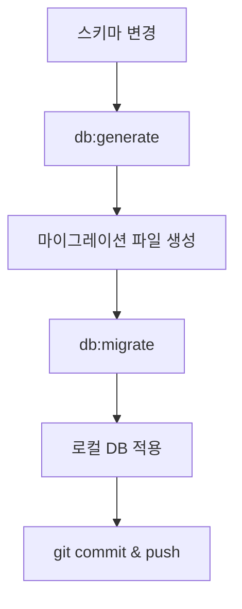
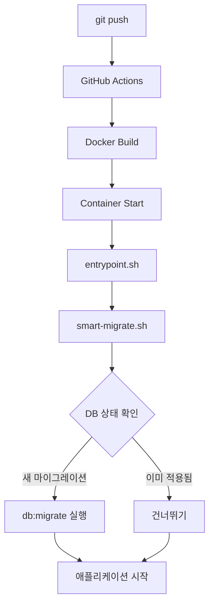

# Database Migration Workflow Guide

Drizzle ORM을 사용한 데이터베이스 마이그레이션 워크플로우 가이드입니다.

## 📚 목차

- [명령어 개요](#명령어-개요)
- [워크플로우 순서](#워크플로우-순서)
- [각 명령어 상세 설명](#각-명령어-상세-설명)
- [실전 예제](#실전-예제)
- [프로덕션 배포](#프로덕션-배포)
- [트러블슈팅](#트러블슈팅)

---

## 명령어 개요

### 주요 명령어

```bash
bun run db:generate   # 마이그레이션 파일 생성
bun run db:migrate    # 마이그레이션 실행 (DB에 적용)
bun run db:push       # 🚫 사용 자제 (히스토리 미기록)
bun run db:studio     # 데이터베이스 GUI 도구
```

### 명령어 비교

| 명령어 | 용도 | 환경 | 히스토리 추적 | 권장 |
|--------|------|------|--------------|------|
| `db:generate` | 마이그레이션 파일 생성 | 개발 | ✅ | ⭐ 필수 |
| `db:migrate` | 마이그레이션 실행 | 로컬/프로덕션 | ✅ | ⭐ 필수 |
| `db:push` | 스키마 직접 동기화 | 개발만 | ❌ | 🚫 **사용 자제** |

> **⚠️ 중요**: `db:push`는 마이그레이션 히스토리를 남기지 않아 팀 협업과 프로덕션 배포에 적합하지 않습니다. **가급적 `db:generate` + `db:migrate`를 사용하세요.**

---

## 워크플로우 순서

### 1️⃣ 로컬 개발 환경



```bash
# 1. 스키마 파일 수정
vim src/db/schema/users.ts

# 2. 마이그레이션 파일 생성
bun run db:generate

# 3. 로컬 DB에 적용
bun run db:migrate

# 4. 테스트 후 커밋
git add drizzle/
git commit -m "feat: add new column to users table"
git push origin main
```

### 2️⃣ 프로덕션 환경 (자동)



---

## 각 명령어 상세 설명

### `bun run db:generate`

**기능**: TypeScript 스키마를 SQL 마이그레이션 파일로 변환

```bash
$ bun run db:generate
```

**실행 과정**:
1. `src/db/schema/*.ts` 파일 읽기
2. 현재 DB 스키마와 비교
3. 변경사항을 SQL 파일로 생성
4. `drizzle/` 디렉토리에 저장

**생성되는 파일**:
```
drizzle/
├── 0001_fancy_hiroim.sql        ← 새 마이그레이션
└── meta/
    ├── 0001_snapshot.json       ← 스냅샷
    └── _journal.json            ← 히스토리
```

**예제 출력**:
```
27 tables
test_migrations 4 columns 0 indexes 0 fks

[✓] Your SQL migration file ➜ drizzle/0001_fancy_hiroim.sql 🚀
```

---

### `bun run db:migrate`

**기능**: 마이그레이션 파일을 데이터베이스에 적용

```bash
$ bun run db:migrate
```

**실행 과정**:
1. `drizzle/` 디렉토리의 SQL 파일 확인
2. `__drizzle_migrations` 테이블에서 적용 이력 확인
3. 미적용 마이그레이션만 실행
4. 적용 후 이력 기록

**예제 출력**:
```
Using 'pg' driver for database querying
[✓] migrations applied successfully!
```

**DB 상태 변화**:
```sql
-- __drizzle_migrations 테이블
┌────┬────────────────────┬───────────────┐
│ id │ hash               │ created_at    │
├────┼────────────────────┼───────────────┤
│ 1  │ 0000_tan_santa_... │ 1760029328030 │
│ 2  │ 0001_fancy_hiroim  │ 1760029972145 │ ← 새로 추가
└────┴────────────────────┴───────────────┘
```

---

### `bun run db:push`

> **🚫 경고: `db:push`는 마이그레이션 히스토리를 남기지 않아 팀 협업/프로덕션 배포에 부적합합니다. 반드시 `db:generate` + `db:migrate`를 사용하세요.**

---

## 실전 예제

### 예제 1: 새 테이블 추가

```typescript
// 1. 스키마 파일 생성
// src/db/schema/notifications.ts
import { pgTable, uuid, varchar, timestamp, boolean } from "drizzle-orm/pg-core";

export const notifications = pgTable("notifications", {
  id: uuid("id").primaryKey().defaultRandom(),
  userId: uuid("user_id").notNull().references(() => users.id),
  title: varchar("title", { length: 255 }).notNull(),
  message: varchar("message", { length: 1000 }),
  isRead: boolean("is_read").default(false).notNull(),
  createdAt: timestamp("created_at", { withTimezone: true }).defaultNow().notNull(),
});
```

```typescript
// 2. schema.ts에 export 추가
// src/db/schema.ts
export * from "./schema/notifications"  // ← 추가
```

```bash
# 3. 마이그레이션 생성
$ bun run db:generate

# 출력:
# [✓] Your SQL migration file ➜ drizzle/0002_notification_table.sql

# 4. 생성된 SQL 확인
$ cat drizzle/0002_notification_table.sql
```

```sql
-- 생성된 SQL
CREATE TABLE "notifications" (
  "id" uuid PRIMARY KEY DEFAULT gen_random_uuid() NOT NULL,
  "user_id" uuid NOT NULL,
  "title" varchar(255) NOT NULL,
  "message" varchar(1000),
  "is_read" boolean DEFAULT false NOT NULL,
  "created_at" timestamp with time zone DEFAULT now() NOT NULL
);

ALTER TABLE "notifications" ADD CONSTRAINT "notifications_user_id_users_id_fk"
  FOREIGN KEY ("user_id") REFERENCES "public"."users"("id")
  ON DELETE no action ON UPDATE no action;
```

```bash
# 5. 로컬 DB에 적용
$ bun run db:migrate

# 6. 테이블 확인
$ psql $DATABASE_URL -c "\dt notifications"
```

```bash
# 7. 커밋 & 푸시
$ git add .
$ git commit -m "feat: add notifications table"
$ git push origin main
```

---

### 예제 2: 컬럼 추가

```typescript
// 1. 기존 스키마 수정
// src/db/schema/users.ts
export const users = pgTable("users", {
  // ... 기존 컬럼
  phoneNumber: varchar("phone_number", { length: 20 }),  // ← 새 컬럼
  lastLoginIp: varchar("last_login_ip", { length: 50 }), // ← 새 컬럼
});
```

```bash
# 2. 마이그레이션 생성
$ bun run db:generate

# 출력:
# [✓] Your SQL migration file ➜ drizzle/0003_add_user_fields.sql
```

```sql
-- 생성된 SQL (drizzle/0003_add_user_fields.sql)
ALTER TABLE "users" ADD COLUMN "phone_number" varchar(20);
ALTER TABLE "users" ADD COLUMN "last_login_ip" varchar(50);
```

```bash
# 3. 로컬 적용
$ bun run db:migrate

# 4. 확인
$ psql $DATABASE_URL -c "\d users"

# 5. 커밋
$ git add drizzle/
$ git commit -m "feat: add phone_number and last_login_ip to users"
$ git push
```

---

### 예제 3: ENUM 타입 추가

```typescript
// 1. ENUM 정의 및 사용
// src/db/schema/orders.ts
import { pgTable, uuid, pgEnum } from "drizzle-orm/pg-core";

export const orderStatusEnum = pgEnum("order_status", [
  "pending",
  "processing",
  "shipped",
  "delivered",
  "cancelled"
]);

export const orders = pgTable("orders", {
  id: uuid("id").primaryKey().defaultRandom(),
  status: orderStatusEnum("status").default("pending").notNull(),
  // ...
});
```

```bash
# 2. 마이그레이션 생성
$ bun run db:generate
```

```sql
-- 생성된 SQL
CREATE TYPE "public"."order_status" AS ENUM(
  'pending',
  'processing',
  'shipped',
  'delivered',
  'cancelled'
);

CREATE TABLE "orders" (
  "id" uuid PRIMARY KEY DEFAULT gen_random_uuid() NOT NULL,
  "status" "order_status" DEFAULT 'pending' NOT NULL
);
```

---

## 프로덕션 배포

### 자동 배포 프로세스

1. **로컬에서 마이그레이션 준비**
   ```bash
   bun run db:generate
   bun run db:migrate  # 로컬 테스트
   git push
   ```

2. **GitHub Actions 실행**
   ```yaml
   # .github/workflows/ci-cd.yml
   - name: Deploy to EC2
     run: |
       docker compose build
       docker compose up -d
   ```

3. **Docker 컨테이너 시작**
   ```dockerfile
   # Dockerfile
   ENTRYPOINT ["./entrypoint.sh"]
   ```

4. **자동 마이그레이션**
   ```bash
   # entrypoint.sh
   sh ./scripts/smart-migrate.sh
   ```

5. **스마트 마이그레이션 로직**
   ```bash
   # scripts/smart-migrate.sh
   if [ 기존 스키마 존재 && 마이그레이션 히스토리 없음 ]; then
     # 히스토리만 초기화 (재실행 안함)
     INSERT INTO __drizzle_migrations ...
   else
     # 새 마이그레이션 실행
     bun run db:migrate
   fi
   ```

### 배포 후 확인

```bash
# SSH 접속
ssh hana

# 마이그레이션 이력 확인
docker exec send-grid-test-postgres-1 psql -U postgres -d postgres \
  -c "SELECT * FROM __drizzle_migrations ORDER BY created_at;"

# 테이블 목록 확인
docker exec send-grid-test-postgres-1 psql -U postgres -d postgres \
  -c "\dt"

# 특정 테이블 구조 확인
docker exec send-grid-test-postgres-1 psql -U postgres -d postgres \
  -c "\d test_migrations"
```

---

## 트러블슈팅

### 문제 1: "type already exists" 오류

**증상**:
```
PostgresError: type "workflow_email_status_enum" already exists
```

**원인**: DB에 이미 스키마가 있는데 마이그레이션 히스토리가 없음

**해결**:
```bash
# 마이그레이션 히스토리 수동 초기화
psql $DATABASE_URL << 'EOF'
INSERT INTO __drizzle_migrations (hash, created_at)
VALUES ('0000_tan_santa_claus', 1760029328030);
EOF
```

---

### 문제 2: 마이그레이션 충돌

**증상**:
```
Error: Migration 0001_xxx.sql conflicts with existing schema
```

**해결**:
```bash
# 1. 현재 DB 상태 백업
bun run db:backup

# 2. 문제되는 마이그레이션 파일 확인
cat drizzle/0001_xxx.sql

# 3. 수동으로 수정하거나 재생성
rm drizzle/0001_xxx.sql
bun run db:generate
```

---

### 문제 3: 로컬과 프로덕션 스키마 불일치

**증상**: 로컬에서는 되는데 프로덕션에서 마이그레이션 실패

**확인**:
```bash
# 로컬 마이그레이션 상태
psql $DATABASE_URL -c "SELECT * FROM __drizzle_migrations;"

# 프로덕션 마이그레이션 상태
ssh hana "docker exec send-grid-test-postgres-1 \
  psql -U postgres -d postgres -c 'SELECT * FROM __drizzle_migrations;'"
```

**해결**:
```bash
# 프로덕션에서 누락된 마이그레이션 확인 후 수동 적용
ssh hana
docker exec -it send-grid-test-elysia-server-1 sh
bun run db:migrate
```

---

### 문제 4: 마이그레이션 롤백이 필요한 경우

**Drizzle은 자동 롤백을 지원하지 않습니다.**

**수동 롤백 방법**:
```bash
# 1. DB 백업에서 복구
bun run db:restore

# 2. 또는 역 마이그레이션 SQL 작성
psql $DATABASE_URL << 'EOF'
DROP TABLE test_migrations;
DELETE FROM __drizzle_migrations WHERE hash = '0001_fancy_hiroim';
EOF
```

---

## 베스트 프랙티스

### ✅ DO

- 항상 `db:generate` → `db:migrate` 순서로 실행
- 마이그레이션 파일을 Git에 커밋
- 로컬에서 먼저 테스트 후 배포
- 프로덕션 배포 전 DB 백업
- 명확한 마이그레이션 커밋 메시지 작성

### ❌ DON'T

- **🚫 `db:push` 사용 금지** (히스토리 미기록으로 협업/배포 불가)
- 생성된 마이그레이션 파일 수동 수정 지양
- 여러 스키마 변경을 한 번에 생성
- 마이그레이션 파일을 Git에서 제외
- `db:push:force` 절대 사용 금지 (데이터 손실 위험)

---

## 추가 자료

- [Drizzle ORM 공식 문서](https://orm.drizzle.team/docs/overview)
- [Drizzle Kit 마이그레이션](https://orm.drizzle.team/kit-docs/overview)
- [PostgreSQL 마이그레이션 가이드](https://www.postgresql.org/docs/current/ddl.html)

---

## 업데이트 이력

- 2025-10-10: 초기 작성
- Smart migration 워크플로우 추가
- 실전 예제 추가
