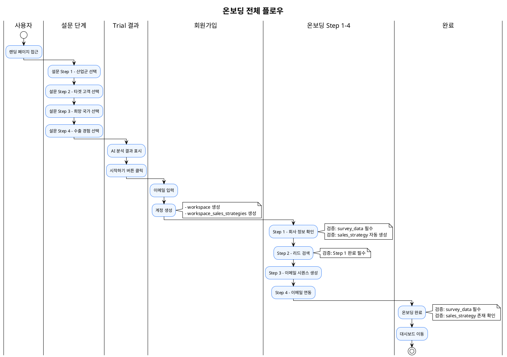
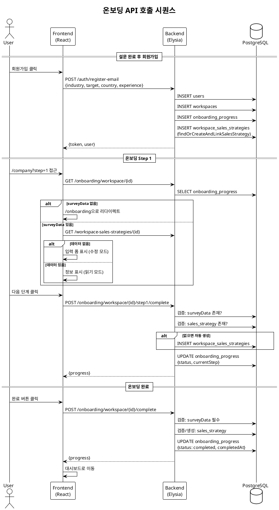
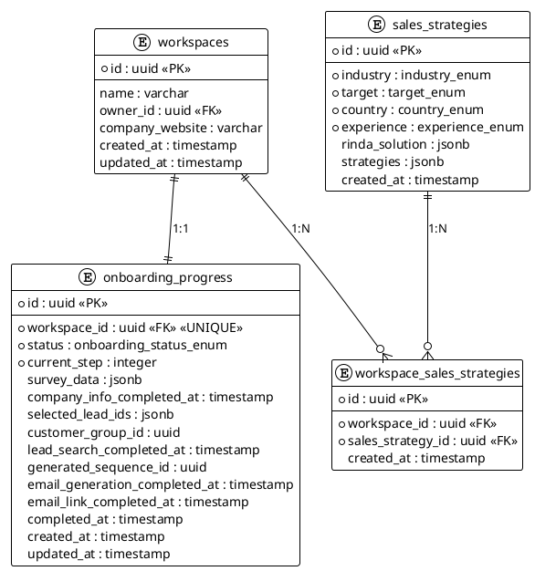
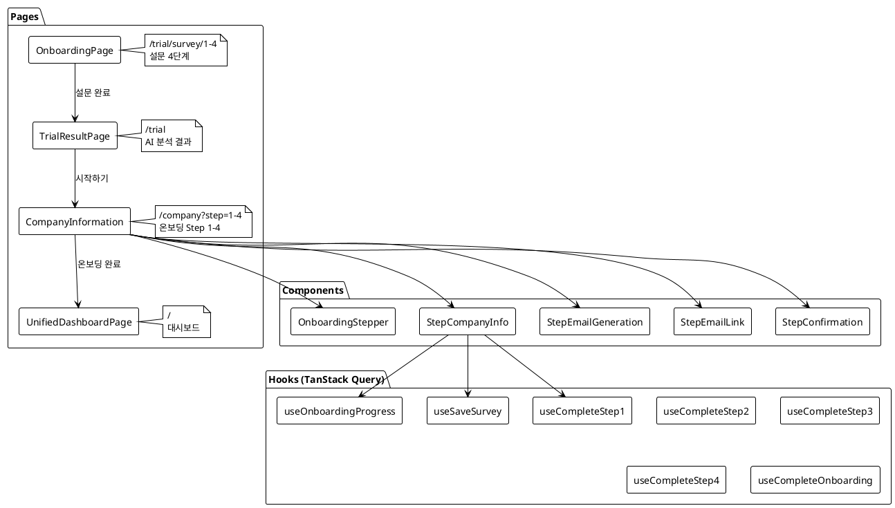

# 온보딩 시스템 아키텍처

> 2025년 12월 기준 최적화된 온보딩 로직

## 목차
- [개요](#개요)
- [전체 플로우](#전체-플로우)
- [데이터 모델](#데이터-모델)
- [API 엔드포인트](#api-엔드포인트)
- [프론트엔드 컴포넌트](#프론트엔드-컴포넌트)
- [검증 로직](#검증-로직)
- [엣지케이스 처리](#엣지케이스-처리)

---

## 개요

온보딩 시스템은 신규 사용자가 서비스를 처음 사용할 때 필요한 정보를 수집하고,
맞춤형 세일즈 전략을 제공하는 프로세스입니다.

### 핵심 원칙
1. **데이터 일관성**: `survey_data`와 `workspace_sales_strategies`는 항상 동시에 저장
2. **단계별 검증**: 각 스텝 완료 시 이전 스텝 및 필수 데이터 검증
3. **엣지케이스 처리**: 설문 데이터 없이 진입 시 자동 리다이렉트

---

## 전체 플로우

### PlantUML 다이어그램



### 시퀀스 다이어그램



---

## 데이터 모델

### ERD



### 온보딩 상태 (Status Enum)

| Status | 설명 | currentStep |
|--------|------|-------------|
| `not_started` | 시작 안함 | 0 |
| `survey_completed` | 설문 완료 | 1 |
| `company_info` | 회사 정보 입력 완료 | 2 |
| `lead_search` | 리드 검색 완료 | 3 |
| `email_generation` | 이메일 생성 완료 | 4 |
| `email_link` | 이메일 연동 완료 | 5 |
| `completed` | 온보딩 완료 | - |

### survey_data 구조

```typescript
interface OnboardingSurveyData {
  industry: "manufacturing" | "it_saas" | "beauty" | "food" |
            "fashion" | "electronics" | "healthcare" | "guitar"
  target: "b2b" | "b2c" | "both"
  country: "jp" | "us" | "sea" | "eu" | "cn" | "ae"
  experience: "none" | "some" | "experienced"
  lang?: "ko" | "en"
}
```

---

## API 엔드포인트

### 온보딩 API (`/api/v1/onboarding`)

| Method | Endpoint | 설명 | 검증 |
|--------|----------|------|------|
| GET | `/workspace/:workspaceId` | 온보딩 진행 상태 조회 | - |
| POST | `/workspace/:workspaceId/survey` | 설문 데이터 저장 | 필수 필드 검증 |
| POST | `/workspace/:workspaceId/step1/complete` | Step 1 완료 | surveyData, salesStrategy |
| POST | `/workspace/:workspaceId/step2/complete` | Step 2 완료 | Step 1 완료 |
| POST | `/workspace/:workspaceId/step3/complete` | Step 3 완료 | Step 1 완료 |
| POST | `/workspace/:workspaceId/step4/complete` | Step 4 완료 | - |
| POST | `/workspace/:workspaceId/complete` | 온보딩 완료 | surveyData 필수 |
| POST | `/workspace/:workspaceId/reset` | 온보딩 리셋 (개발용) | - |

### Sales Strategy API (`/api/v1/workspace-sales-strategies`)

| Method | Endpoint | 설명 |
|--------|----------|------|
| GET | `/:workspaceId` | 워크스페이스의 세일즈 전략 조회 |
| PUT | `/:workspaceId` | 세일즈 전략 업데이트 (없으면 생성) |
| POST | `/:workspaceId/find-and-link` | 세일즈 전략 찾아서 연결 |

---

## 프론트엔드 컴포넌트

### 컴포넌트 구조



### 라우팅 플로우

```
/trial/survey/1 → /trial/survey/2 → /trial/survey/3 → /trial/survey/4
                                                            ↓
                                                        /trial
                                                            ↓
                                                   회원가입 (모달)
                                                            ↓
/company?step=1 → /company?step=2 → /company?step=3 → /company?step=4
                                                            ↓
                                                    / (대시보드)
```

---

## 검증 로직

### 백엔드 검증 (onboarding.service.ts)

```typescript
// saveSurveyData - 필수 필드 검증
if (!surveyData.industry || !surveyData.target ||
    !surveyData.country || !surveyData.experience) {
  throw new OnboardingValidationError(
    "설문 데이터가 불완전합니다",
    "INCOMPLETE_SURVEY_DATA"
  )
}

// completeStep1CompanyInfo - surveyData + salesStrategy 검증
if (!progress.surveyData) {
  throw new OnboardingValidationError(
    "설문 데이터가 없습니다",
    "MISSING_SURVEY_DATA"
  )
}
// salesStrategy 없으면 자동 생성

// completeStep2LeadSearch - Step 1 완료 검증
if (!progress.companyInfoCompleted) {
  throw new OnboardingValidationError(
    "Step 1을 먼저 완료해주세요",
    "STEP1_NOT_COMPLETED"
  )
}

// completeOnboarding - surveyData 필수 + salesStrategy 자동 생성
if (!progress.surveyData) {
  throw new OnboardingValidationError(
    "온보딩을 완료할 수 없습니다. 설문 데이터가 없습니다.",
    "MISSING_SURVEY_DATA"
  )
}
```

### 프론트엔드 검증

```typescript
// CompanyInformation.tsx - surveyData 없으면 리다이렉트
useEffect(() => {
  if (workspaceId && !hasSurveyData) {
    navigate("/onboarding", { replace: true })
  }
}, [workspaceId, hasSurveyData])

// StepCompanyInfo.tsx - 데이터 없으면 수정 모드
useEffect(() => {
  // fetch 실패 시 자동 수정 모드
  if (error) setIsEditing(true)
}, [])

// handleSave - 필수 필드 검증
if (!editedData.industry || !editedData.target ||
    !editedData.country || !editedData.experience) {
  toast.error("모든 필드를 입력해주세요")
  return
}
```

---

## 엣지케이스 처리

### 1. 기존 유저가 설문 없이 온보딩 진입

**문제**: `onboarding_progress.survey_data`가 NULL인 상태로 `/company` 접근

**해결**:
1. `CompanyInformation.tsx`에서 `hasSurveyData` 체크
2. 없으면 `/onboarding`으로 리다이렉트
3. `StepCompanyInfo.tsx`에서 백업으로 수정 모드 자동 활성화

### 2. survey_data는 있지만 workspace_sales_strategies 없음

**문제**: 데이터 동기화 실패로 sales_strategy만 없는 경우

**해결**:
1. `completeStep1CompanyInfo()`에서 자동 생성
2. `completeOnboarding()`에서 자동 생성
3. `saveSurveyData()`에서 동시 저장

### 3. 온보딩 중간 이탈 후 재진입

**문제**: 일부 스텝만 완료된 상태에서 재진입

**해결**:
1. `onboarding_progress.currentStep` 기반으로 마지막 스텝 복원
2. 각 스텝 완료 함수에서 이전 스텝 검증

### 4. 설문 데이터 수정

**문제**: 사용자가 설문 데이터를 수정하고 싶은 경우

**해결**:
1. `StepCompanyInfo.tsx`에서 "수정" 버튼 제공
2. `handleSave()`에서 `onboarding/survey` + `workspace-sales-strategies` 동시 업데이트

---

## 파일 구조

```
admin/src/
├── pages/
│   ├── onboarding/
│   │   ├── index.tsx           # 설문 페이지 (Step 1-4)
│   │   └── types.ts            # 온보딩 타입 정의
│   ├── app/
│   │   ├── CompanyInformation.tsx  # 온보딩 Step 1-4 메인
│   │   └── components/
│   │       ├── OnboardingStepper.tsx
│   │       ├── StepCompanyInfo.tsx
│   │       ├── StepEmailGeneration.tsx
│   │       ├── StepEmailLink.tsx
│   │       └── StepConfirmation.tsx
│   ├── TrialResultPage.tsx     # AI 분석 결과
│   └── UnifiedDashboardPage.tsx # 대시보드
└── lib/api/
    ├── hooks/
    │   └── onboarding.ts       # TanStack Query hooks
    └── services/
        └── onboarding.ts       # API 서비스

elysia-server/src/
├── db/schema/
│   └── onboarding.ts           # DB 스키마
├── services/
│   ├── onboarding.service.ts   # 온보딩 비즈니스 로직
│   └── sales-strategy.service.ts
└── routes/
    ├── onboarding.routes.ts    # 온보딩 API 라우트
    └── sales-strategies.routes.ts
```

---

## 변경 이력

| 날짜 | 변경 내용 |
|------|----------|
| 2025-12-15 | 초기 문서 작성 |
| 2025-12-15 | 데이터 동기화 로직 추가 (survey_data + sales_strategy) |
| 2025-12-15 | 검증 로직 강화 (각 스텝별 검증) |
| 2025-12-15 | 엣지케이스 처리 로직 추가 |
