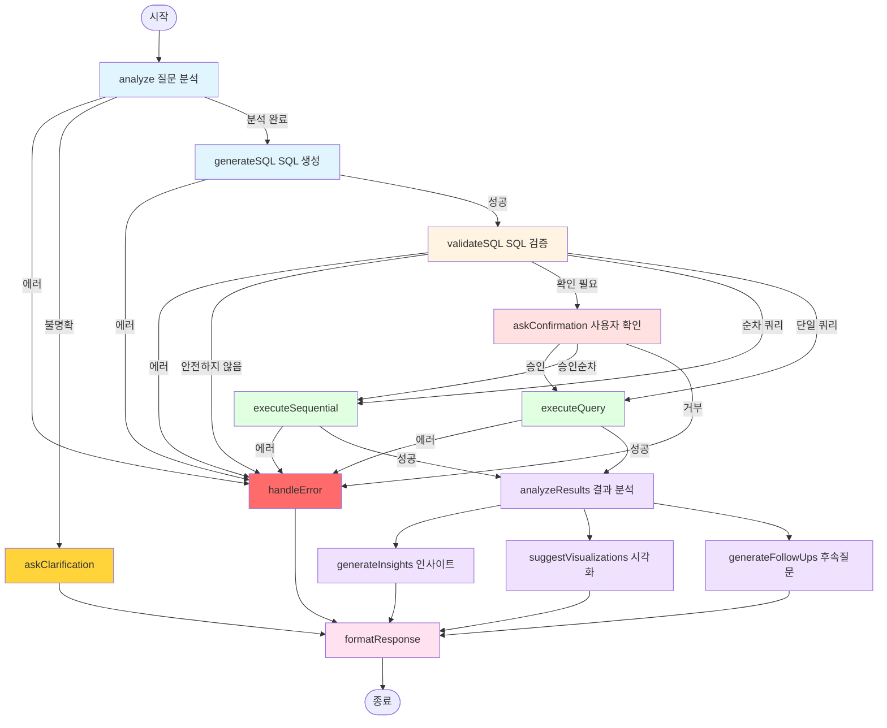

# Chatbot LangGraph 구조 분석

> 분석 일자: 2025-11-05
> 경로: `elysia-server/src/services/chatbot/`

## 개요

이 문서는 현재 구현된 Chatbot 서비스의 LangGraph 구조를 상세히 분석합니다. LangGraph를 사용하여 자연어 질문을 SQL로 변환하고 실행하는 Text-to-SQL 워크플로우를 구현하고 있습니다.

## 디렉토리 구조

```
elysia-server/src/services/chatbot/
├── graph.ts                    # LangGraph 워크플로우 정의 (메인)
├── state.ts                    # 상태(State) 타입 및 Annotation 정의
├── index.ts                    # 외부 export
├── prompts.ts                  # LLM 프롬프트 정의
├── schema-context.ts           # 데이터베이스 스키마 컨텍스트
├── sse-context.ts              # Server-Sent Events 컨텍스트
└── nodes/                      # 각 노드 구현
    ├── analyze.ts              # 질문 분석
    ├── sql-generator.ts        # SQL 생성
    ├── sql-validator.ts        # SQL 검증
    ├── query-executor.ts       # 쿼리 실행 (단일)
    ├── sequential-executor.ts  # 쿼리 순차 실행
    ├── result-analyzer.ts      # 결과 분석
    ├── insight-generator.ts    # 인사이트 생성
    ├── visualization-suggester.ts  # 시각화 제안
    └── follow-up-generator.ts  # 후속 질문 생성
```

## 1. State 관리 (state.ts)

### ChatbotState 인터페이스

LangGraph의 상태를 관리하는 핵심 타입입니다. 워크플로우 전체에서 공유되는 데이터를 정의합니다.

```typescript
interface ChatbotState {
  // 대화 흐름
  messages: ChatMessage[]
  currentQuestion: string
  conversationId: string

  // SSE Context (런타임에 주입, 직렬화되지 않음)
  _emitter?: NodeEventEmitter

  // 메타데이터
  metadata?: {
    intent?: string
    requiredTables?: string[]
    timeRange?: string | null
    analysisType?: string
    operationType?: "read" | "create" | "update" | "delete"
  }

  // SQL 생성
  generatedSQL: string
  sqlExplanation: string
  isQuerySafe: boolean

  // 순차 실행
  sqlQueries: string[]
  currentQueryIndex: number
  sequentialResults: unknown[][]

  // 실행 결과
  queryResult: unknown[]
  executionTime: number
  error: string | null
  affectedRows?: number

  // 분석
  analysis: string
  insights: Insight[]
  visualizationSuggestions: VisualizationSuggestion[]

  // 컨텍스트
  workspaceId: string
  userId: string
  schemaContext: string
  previousQueries: QueryHistory[]

  // Human-in-the-Loop
  needsConfirmation: boolean
  confirmationMessage: string
  isConfirmed: boolean

  // CSV 처리
  csvData?: {
    headers: string[]
    rows: Record<string, string>[]
    rowCount: number
  }
}
```

### ChatbotStateAnnotation

LangGraph의 `Annotation.Root`를 사용하여 상태 업데이트 방식을 정의합니다.

- **Reducer**: 상태가 업데이트될 때 어떻게 병합할지 정의
- **Default**: 초기값 정의

주요 reducer 패턴:
- **배열 확장**: `messages`, `previousQueries` - 기존 배열에 새 항목 추가
- **값 교체**: `currentQuestion`, `generatedSQL` - 새 값으로 완전히 교체
- **객체 병합**: `metadata` - 기존 객체와 새 객체 병합

## 2. Graph 워크플로우 (graph.ts)

### 노드 정의

총 **13개의 노드**로 구성되어 있습니다:

| 노드 이름 | 파일 | 설명 |
|---------|------|------|
| `analyze` | analyze.ts | 사용자 질문 분석, 의도 파악, 필요한 테이블 식별 |
| `generateSQL` | sql-generator.ts | 자연어 질문을 SQL 쿼리로 변환 |
| `validateSQL` | sql-validator.ts | 생성된 SQL의 보안 및 안전성 검증 |
| `askConfirmation` | graph.ts | Human-in-the-Loop: 사용자 확인 요청 (mutation) |
| `executeQuery` | query-executor.ts | 단일 SQL 쿼리 실행 |
| `executeSequential` | sequential-executor.ts | 여러 SQL 쿼리를 순차적으로 실행 |
| `analyzeResults` | result-analyzer.ts | 쿼리 결과 분석 및 설명 생성 |
| `generateInsights` | insight-generator.ts | 데이터 인사이트 생성 (병렬) |
| `suggestVisualizations` | visualization-suggester.ts | 시각화 제안 생성 (병렬) |
| `generateFollowUps` | follow-up-generator.ts | 후속 질문 생성 (병렬) |
| `formatResponse` | graph.ts | 최종 응답 포맷팅 |
| `handleError` | graph.ts | 에러 처리 |
| `askClarification` | graph.ts | 불명확한 질문에 대한 추가 정보 요청 |

### 워크플로우 흐름



### 라우팅 로직

#### 1. `routeAfterAnalysis`
```typescript
function routeAfterAnalysis(state: ChatbotState): NodeName {
  if (state.error) return "handleError"
  if (state.needsClarification) return "askClarification"
  return "generateSQL"
}
```

#### 2. `routeAfterSQLGeneration`
```typescript
function routeAfterSQLGeneration(state: ChatbotState): NodeName {
  if (state.error) return "handleError"
  if (!state.generatedSQL || state.generatedSQL.trim().length === 0) {
    return "handleError"
  }
  return "validateSQL"
}
```

#### 3. `routeAfterValidation`
```typescript
function routeAfterValidation(state: ChatbotState): NodeName {
  if (state.error) return "handleError"
  if (!state.isQuerySafe && !state.isConfirmed) return "handleError"

  // Human-in-the-Loop: mutation 확인 필요
  if (state.needsConfirmation && !state.isConfirmed) {
    return "askConfirmation"
  }

  // 순차 실행 vs 단일 실행
  if (state.sqlQueries && state.sqlQueries.length > 1) {
    return "executeSequential"
  }
  return "executeQuery"
}
```

#### 4. `routeAfterExecution`
```typescript
function routeAfterExecution(state: ChatbotState): NodeName {
  if (state.error && state.queryResult.length === 0) {
    return "handleError"
  }
  return "analyzeResults"
}
```

### 병렬 실행

`analyzeResults` 이후 3개의 노드가 **병렬로 실행**됩니다:

1. `generateInsights` - 데이터 인사이트 생성
2. `suggestVisualizations` - 차트/그래프 제안
3. `generateFollowUps` - 후속 질문 생성

모든 병렬 노드가 완료되면 `formatResponse`로 수렴합니다.

## 3. Human-in-the-Loop (graph.ts:75-148)

### askConfirmation 노드

mutation 쿼리(INSERT, UPDATE, DELETE)에 대해 사용자 확인을 요청합니다.

```typescript
async function askConfirmation(state: ChatbotState): Promise<Command> {
  // interrupt() 함수를 사용하여 실행을 일시 중지
  const userDecision = interrupt({
    type: "confirmation_required",
    confirmationMessage: state.confirmationMessage,
    metadata: {
      sql: state.generatedSQL,
      sqlQueries: state.sqlQueries,
      sqlExplanation: state.sqlExplanation,
      queryCount: state.sqlQueries?.length || 1,
    },
  })

  // 사용자 결정에 따라 라우팅
  if (userDecision === true || userDecision?.confirmed) {
    if (state.sqlQueries && state.sqlQueries.length > 1) {
      return new Command({ goto: "executeSequential" })
    }
    return new Command({ goto: "executeQuery" })
  }

  // 거부 시 에러 처리
  return new Command({
    goto: "handleError",
    update: {
      error: "작업이 사용자에 의해 취소되었습니다.",
      analysis: "작업이 취소되었습니다.",
    },
  })
}
```

### Checkpoint 메커니즘

```typescript
// Singleton MemorySaver: 요청 간 checkpoint 공유
let sharedCheckpointer: MemorySaver | null = null

export function getSharedCheckpointer(): MemorySaver {
  if (!sharedCheckpointer) {
    sharedCheckpointer = new MemorySaver()
  }
  return sharedCheckpointer
}

// Graph 컴파일 시 checkpointer 설정
return workflow.compile({
  checkpointer: getSharedCheckpointer(),
})
```

**중요**: Singleton 패턴 사용 이유
- `/ask` 요청에서 `interrupt()`가 호출되어 checkpoint 생성
- `/confirm` 요청에서 동일한 checkpointer를 사용하여 checkpoint에서 재개
- 서로 다른 HTTP 요청이지만 동일한 메모리 인스턴스를 공유

## 4. 주요 노드 구현 분석

### 4.1 analyzeQuestion (nodes/analyze.ts)

**목적**: 사용자 질문을 분석하여 의도, 필요한 테이블, 시간 범위 등을 파악

**LLM 모델**: `gpt-4.1-mini` (temperature: 0.3)

**프로세스**:
1. CSV 데이터가 있는지 확인
2. 적절한 프롬프트 선택 (CSV 포함/미포함)
3. LLM 스트리밍으로 분석 수행
4. JSON 응답 파싱
5. 스키마 컨텍스트 준비

**출력**:
```typescript
{
  metadata: {
    intent: string
    requiredTables: string[]
    timeRange: string | null
    analysisType: string
    operationType: "read" | "create" | "update" | "delete"
  },
  needsClarification: boolean,
  clarificationQuestion: string,
  schemaContext: string
}
```

### 4.2 generateSQL (nodes/sql-generator.ts)

**목적**: 분석된 질문을 기반으로 SQL 쿼리 생성

**LLM 모델**: `gpt-4.1-mini` (temperature: 0.1 - 정확성 우선)

**출력 형식**:
1. **단일 쿼리**:
   ```json
   {
     "sql": "SELECT ...",
     "explanation": "...",
     "estimatedRows": 10
   }
   ```

2. **순차 쿼리** (복잡한 mutation):
   ```json
   {
     "queries": [
       "INSERT INTO ...",
       "UPDATE ..."
     ],
     "explanation": "..."
   }
   ```

### 4.3 validateSQL (nodes/sql-validator.ts)

**목적**: SQL의 보안 및 안전성 검증

**검증 항목**:
1. **위험한 작업 차단**: `DROP`, `ALTER`, `CREATE TABLE`, `TRUNCATE`
2. **workspace_id 필터 필수**: 데이터 격리 보장
3. **쿼리 복잡도 제한**:
   - CTE: 최대 3개
   - UNION: 최대 5개
   - Subquery: 최대 5개

**출력**:
```typescript
{
  isQuerySafe: boolean,
  error: string | null,
  needsConfirmation: boolean
}
```

### 4.4 executeQuery (nodes/query-executor.ts)

**목적**: 단일 SQL 쿼리 실행

**특징**:
- 타임아웃: 60초
- 최대 결과 행: 1,000개
- 상세한 에러 처리 (23개 이상의 에러 타입 분류)

**에러 처리 예시**:
- `23502`: NOT NULL constraint violation
- `23505`: UNIQUE constraint violation
- `23503`: FOREIGN KEY constraint violation
- `23514`: CHECK constraint violation
- `22001`: String too long
- `42601`: Syntax error

### 4.5 executeSequential (nodes/sequential-executor.ts)

**목적**: 여러 SQL 쿼리를 순차적으로 실행

**특징**:
- 플레이스홀더 치환: `{{PREV_QUERY_1_ID}}` → 이전 쿼리의 실제 ID
- 각 쿼리의 RETURNING 결과에서 ID 추출
- 트랜잭션 없음 (각 쿼리 독립 실행)

**예시**:
```sql
-- Query 1
INSERT INTO leads (name, workspace_id)
VALUES ('John', 'ws123')
RETURNING id; -- Returns: '550e8400-e29b-41d4-a716-446655440000'

-- Query 2 (자동 치환)
INSERT INTO lead_tags (lead_id, tag)
VALUES ('{{PREV_QUERY_1_ID}}', 'vip');
-- 실제 실행: VALUES ('550e8400-e29b-41d4-a716-446655440000', 'vip')
```

### 4.6 analyzeResults (nodes/result-analyzer.ts)

**목적**: 쿼리 결과를 사용자 친화적으로 분석

**특별 처리**:
1. **Mutation 쿼리**: "✅ Successfully created 5 rows"
2. **빈 결과**: "No results found. Try different conditions."
3. **일반 SELECT**: LLM을 통한 자연어 설명 생성

**LLM 모델**: `gpt-4.1-mini` (temperature: 0.3)

### 4.7 generateInsights (nodes/insight-generator.ts)

**목적**: 데이터에서 비즈니스 인사이트 추출

**LLM 모델**: `gpt-4.1-mini` (temperature: 0.7 - 창의성 우선)

**출력 형식**:
```json
[
  {
    "insight": "Sales increased 25% compared to last month",
    "recommendation": "Consider increasing inventory",
    "impact": "high",
    "category": "sales"
  }
]
```

**조건**: 결과가 2개 이상일 때만 실행 (단일 결과는 인사이트 부족)

## 5. SSE 컨텍스트 (sse-context.ts)

### NodeEventEmitter

각 노드가 실시간으로 진행 상황을 클라이언트에 전송할 수 있습니다.

**이벤트 타입**:
1. `node-start`: 노드 시작
2. `progress`: 진행률 업데이트
3. `text_chunk`: LLM 스트리밍 청크
4. `node-complete`: 노드 완료
5. `error`: 에러 발생

**사용 예시**:
```typescript
// 노드 시작
emitter.nodeStart("generateSQL", "SQL 쿼리를 생성하는 중...")

// 진행률 업데이트
emitter.progress("generateSQL", "SQL 쿼리 생성 시작...", 20)

// LLM 스트리밍
const stream = await llm.stream(prompt)
const content = await streamLLMResponse(emitter, "generateSQL", stream)

// 노드 완료
emitter.nodeComplete("generateSQL", "SQL 쿼리 생성 완료")
```

### streamLLMResponse 헬퍼

LLM 스트리밍 응답을 자동으로 청크 단위로 전송합니다.

**특징**:
- Throttling: 50ms 간격으로 전송 (클라이언트 과부하 방지)
- 클라이언트 연결 체크
- 최종 누적 텍스트 반환

## 6. 데이터 흐름 예시

### 시나리오 1: 단순 SELECT 쿼리

```
사용자: "최근 1주일간 생성된 리드 수를 알려줘"

1. analyze
   → metadata: { intent: "count", requiredTables: ["leads"], timeRange: "1 week" }

2. generateSQL
   → generatedSQL: "SELECT COUNT(*) FROM leads WHERE workspace_id = 'ws123'
                     AND created_at >= NOW() - INTERVAL '7 days'"

3. validateSQL
   → isQuerySafe: true, needsConfirmation: false

4. executeQuery
   → queryResult: [{ count: 42 }], executionTime: 120ms

5. analyzeResults
   → analysis: "42개의 리드가 최근 1주일간 생성되었습니다."

6. generateInsights (병렬)
   → insights: [{ insight: "Daily average: 6 leads", impact: "medium" }]

7. suggestVisualizations (병렬)
   → visualizations: [{ type: "line", title: "Daily Lead Count" }]

8. generateFollowUps (병렬)
   → followUpQuestions: ["Which source generated the most leads?"]

9. formatResponse
   → 최종 응답 생성 및 반환
```

### 시나리오 2: Mutation 쿼리 (Human-in-the-Loop)

```
사용자: "모든 VIP 리드의 우선순위를 높음으로 변경해줘"

1. analyze
   → metadata: { intent: "update", operationType: "update", requiredTables: ["leads"] }

2. generateSQL
   → generatedSQL: "UPDATE leads SET priority = 'high'
                     WHERE workspace_id = 'ws123' AND tags LIKE '%vip%'"

3. validateSQL
   → isQuerySafe: true, needsConfirmation: true
   → confirmationMessage: "VIP 태그가 있는 모든 리드의 우선순위를 변경하시겠습니까?"

4. askConfirmation
   → interrupt() 호출
   → 클라이언트에 __interrupt__ 이벤트 전송
   → 사용자 응답 대기...

5. [사용자 승인]

6. executeQuery
   → affectedRows: 12, executionTime: 85ms

7. analyzeResults
   → analysis: "✅ Successfully updated 12 rows."

8. formatResponse
   → 최종 응답 생성
```

### 시나리오 3: CSV 임포트 (순차 실행)

```
사용자: "첨부한 CSV 파일의 리드를 데이터베이스에 임포트해줘"
(CSV: 100개 행)

1. analyze
   → csvData: { headers: ["name", "email"], rows: [...], rowCount: 100 }

2. generateSQL
   → queries: [
       "INSERT INTO leads (...) VALUES ...",  // 배치 1
       "INSERT INTO leads (...) VALUES ...",  // 배치 2
       "INSERT INTO leads (...) VALUES ..."   // 배치 3
     ]

3. validateSQL
   → needsConfirmation: true

4. askConfirmation
   → interrupt() 및 사용자 승인 대기

5. executeSequential
   → 쿼리 1 실행: 40 rows inserted
   → 쿼리 2 실행: 40 rows inserted
   → 쿼리 3 실행: 20 rows inserted
   → sequentialResults: [40, 40, 20]

6. analyzeResults
   → analysis: "✅ Successfully created 100 rows."

7. formatResponse
```

## 7. 성능 최적화 포인트

### 병렬 실행
- `analyzeResults` 이후 인사이트/시각화/후속질문이 동시에 생성됨
- 총 실행 시간 = max(insight, viz, followup) (not sum)

### LLM 스트리밍
- 모든 LLM 호출에서 스트리밍 활성화
- 사용자에게 실시간 피드백 제공
- 체감 대기 시간 감소

### 쿼리 제한
- 최대 1,000 rows 반환
- 60초 타임아웃
- 복잡도 제한 (CTE 3개, UNION 5개, Subquery 5개)

### Checkpoint 관리
- Singleton MemorySaver로 메모리 효율성
- 불필요한 checkpoint 생성 방지

## 8. 보안 고려사항

### SQL Injection 방지
1. **Drizzle ORM 사용**: `sql.raw()` 사용 시에도 파라미터 바인딩
2. **workspace_id 필터 강제**: 데이터 격리 보장
3. **위험한 쿼리 차단**: DROP, ALTER, TRUNCATE 등

### Human-in-the-Loop
- 모든 mutation 작업은 사용자 확인 필요
- `needsConfirmation` 플래그로 제어
- 확인되지 않은 mutation은 실행 불가

### 에러 정보 노출 제어
- 데이터베이스 내부 에러를 사용자 친화적 메시지로 변환
- 민감한 스키마 정보 숨김

## 9. 확장 가능성

### 새 노드 추가
```typescript
// 1. 노드 함수 작성
async function myNewNode(state: ChatbotState): Promise<Partial<ChatbotState>> {
  // 구현
}

// 2. 노드 등록
workflow.addNode("myNewNode", myNewNode)

// 3. 엣지 연결
workflow.addEdge("someNode", "myNewNode")
```

### 새 라우팅 조건
```typescript
function routeAfterMyNode(state: ChatbotState): NodeName {
  if (state.someCondition) return "nodeA"
  return "nodeB"
}

workflow.addConditionalEdges("myNewNode", routeAfterMyNode, {
  nodeA: "nodeA",
  nodeB: "nodeB",
})
```

### 새 State 필드
```typescript
// state.ts
export interface ChatbotState {
  // 기존 필드...
  myNewField: string
}

export const ChatbotStateAnnotation = Annotation.Root({
  // 기존 필드...
  myNewField: Annotation<string>({
    reducer: (prev, next) => (next !== undefined ? next : prev),
    default: () => "",
  }),
})
```

## 10. 주요 개선 가능 영역

### 1. 재시도 로직 부재
현재는 쿼리 실패 시 즉시 에러 처리. 일시적 에러에 대한 재시도 메커니즘 추가 고려.

### 2. 캐싱 전략
동일한 질문에 대한 결과를 캐싱하여 LLM 호출 최소화 가능.

### 3. 트랜잭션 지원
`executeSequential`이 트랜잭션을 사용하지 않음. 실패 시 롤백 불가.

### 4. 동적 프롬프트 개선
현재는 정적 프롬프트. Few-shot learning이나 RAG 패턴 적용 고려.

### 5. 메트릭/모니터링
각 노드의 성능 메트릭 수집 및 대시보드 구축.

## 11. 결론

현재 Chatbot LangGraph 구조는:
- **13개의 노드**로 구성된 복잡한 워크플로우
- **Human-in-the-Loop** 패턴으로 안전한 mutation 작업
- **병렬 실행**으로 성능 최적화
- **SSE 스트리밍**으로 실시간 피드백
- **순차 실행** 지원으로 복잡한 작업 처리

잘 설계된 아키텍처로, 확장 가능하고 유지보수하기 좋은 구조를 갖추고 있습니다.

## 참고 자료

- [LangGraph 공식 문서](https://langchain-ai.github.io/langgraph/)
- 관련 문서:
  - `docs/langgraph-chatbot-implementation.md`
  - `docs/langgraph-human-in-loop-implementation.md`
  - `docs/elysia-langgraph-integration.md`
