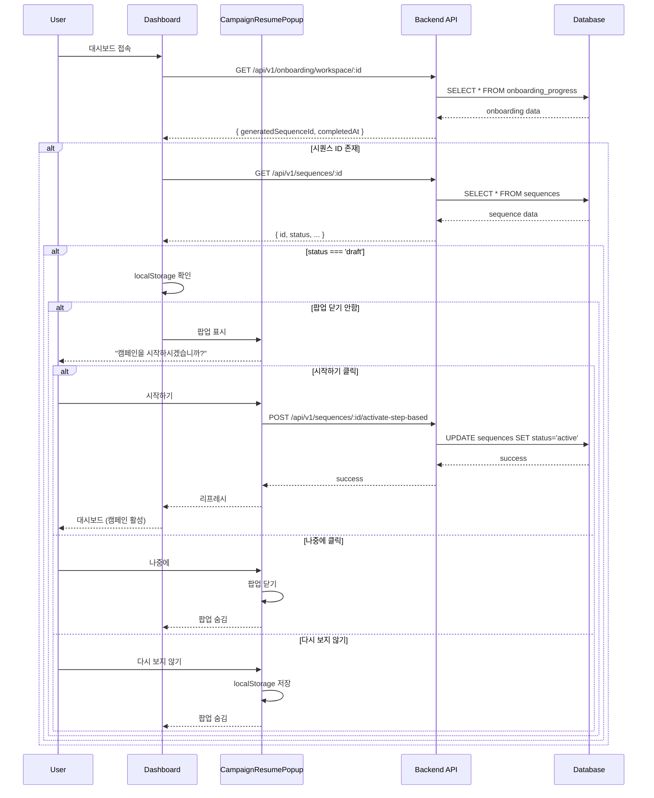

# 캠페인 재시작 팝업 구현 계획

## 개요

온보딩 완료 시 "나중에 하기"를 선택한 사용자에게 대시보드에서 캠페인 시작을 유도하는 팝업을 추가합니다.

## 문제 정의

### 현재 상황
- 온보딩 Step 4 (StepConfirmation.tsx)에서 "나중에 할게요" 버튼 클릭 시:
  1. `completeOnboardingAndClearData()` 호출하여 온보딩 완료로 마킹
  2. `/dashboard`로 리다이렉트
  3. 생성된 시퀀스는 `draft` 상태로 유지됨
  4. 대시보드에서 시퀀스 시작을 유도하는 UI 없음

### 문제점
- 사용자가 캠페인을 시작하지 않은 채 대시보드에 머물 수 있음
- 온보딩 과정에서 생성된 리드와 이메일을 활용하지 못함
- 사용자가 캠페인 시작 방법을 찾기 어려움

## 해결 방안

### 핵심 아이디어
1. 대시보드 진입 시 온보딩 완료 여부 및 시퀀스 상태 확인
2. 조건 충족 시 대시보드 최상단에 팝업 표시
3. 팝업에서 캠페인 시작 또는 나중에 다시 보기 선택 가능

### 팝업 표시 조건
```typescript
// 다음 조건을 모두 만족할 때 팝업 표시:
1. onboardingProgress.completedAt !== null (온보딩 완료)
2. onboardingProgress.generatedSequenceId !== null (시퀀스 존재)
3. sequence.status === 'draft' (아직 시작 안함)
4. localStorage의 'campaign_resume_dismissed' !== 'true' (다시 보지 않기 선택 안함)
```

## 아키텍처

### 전체 폴더 구조
```
admin/src/
├── pages/
│   ├── UnifiedDashboardPage.tsx          # 대시보드 메인 (팝업 통합)
│   └── app/
│       ├── AppDashboardPage.tsx          # 대시보드 콘텐츠
│       └── components/
│           ├── CampaignResumePopup.tsx   # 🆕 팝업 컴포넌트
│           └── StepConfirmation.tsx      # 기존 Step 4
├── lib/api/
│   ├── hooks/
│   │   └── sequences.ts                  # 🔧 시퀀스 조회 훅 추가
│   └── services/
│       └── sequences.ts                  # 🔧 시퀀스 API 서비스
└── components/ui/
    └── alert-dialog.tsx                  # Shadcn UI (이미 존재)

elysia-server/src/
├── routes/
│   └── sequences.routes.ts               # 기존 API (수정 불필요)
└── services/
    └── sequence.service.ts               # 기존 서비스 (수정 불필요)
```

### 컴포넌트 다이어그램

```mermaid
flowchart TB
    subgraph "Dashboard Flow"
        A[UnifiedDashboardPage] --> B{온보딩 완료?}
        B -->|Yes| C[AppDashboardPage 로드]
        B -->|No| D[/company로 리다이렉트]

        C --> E{시퀀스 존재 & draft?}
        E -->|Yes| F{팝업 닫기 했나?}
        E -->|No| G[일반 대시보드 표시]

        F -->|No| H[CampaignResumePopup 표시]
        F -->|Yes| G

        H --> I{사용자 선택}
        I -->|시작하기| J[캠페인 시작 API 호출]
        I -->|나중에| K[팝업 닫기]
        I -->|다시 보지 않기| L[localStorage 저장 + 팝업 닫기]

        J --> M[sequence status -> active]
        M --> N[대시보드 리프레시]

        K --> G
        L --> G
    end
```

### 데이터 흐름



## 구현 상세

### 1. 팝업 컴포넌트 (CampaignResumePopup.tsx)

#### Props
```typescript
interface CampaignResumePopupProps {
  sequenceId: string           // 시작할 시퀀스 ID
  onComplete: () => void        // 캠페인 시작 완료 시 콜백
  onDismiss: () => void         // 나중에/다시 보지 않기 시 콜백
}
```

#### 주요 기능
1. **캠페인 정보 표시**
   - 온보딩에서 생성된 리드 수
   - 이메일 시퀀스 스텝 수
   - 예상 발송 이메일 수

2. **액션 버튼**
   - "지금 시작하기" (Primary) - 캠페인 활성화
   - "나중에 할게요" (Secondary) - 팝업만 닫기
   - "다시 보지 않기" (Text) - localStorage에 저장 후 닫기

3. **상태 관리**
   - 로딩 상태 (API 호출 중)
   - 에러 상태 (API 실패 시)

#### UI 디자인
- AlertDialog 기반 (Shadcn UI)
- 대시보드 최상단 중앙 위치
- 모달 오버레이로 다른 액션 차단
- 모바일 반응형 디자인

### 2. 대시보드 통합 (UnifiedDashboardPage.tsx)

#### 수정 사항
```typescript
// 기존 코드에 추가
const { data: sequence } = useSequence(
  onboardingProgress?.generatedSequenceId || "",
  !!onboardingProgress?.generatedSequenceId
)

// 팝업 표시 여부 판단
const shouldShowPopup = useMemo(() => {
  if (!onboardingProgress?.completedAt) return false
  if (!sequence?.id) return false
  if (sequence.status !== 'draft') return false

  const dismissed = localStorage.getItem('campaign_resume_dismissed')
  return dismissed !== 'true'
}, [onboardingProgress, sequence])

// 팝업 컴포넌트 렌더링
{shouldShowPopup && (
  <CampaignResumePopup
    sequenceId={sequence.id}
    onComplete={() => {
      refetchSequence()
      refetchOnboardingProgress()
    }}
    onDismiss={() => {
      setShowPopup(false)
    }}
  />
)}
```

### 3. API 훅 추가 (sequences.ts)

#### useSequence Hook
```typescript
export function useSequence(sequenceId: string, enabled = true) {
  return useQuery({
    queryKey: ['sequence', sequenceId],
    queryFn: () => sequencesApi.getById(sequenceId),
    enabled: enabled && !!sequenceId,
  })
}
```

#### useActivateSequence Mutation
```typescript
export function useActivateSequence() {
  const queryClient = useQueryClient()

  return useMutation({
    mutationFn: (sequenceId: string) =>
      sequencesApi.activate(sequenceId),
    onSuccess: (data, sequenceId) => {
      queryClient.invalidateQueries({ queryKey: ['sequence', sequenceId] })
      queryClient.invalidateQueries({ queryKey: ['sequences'] })
    },
  })
}
```

### 4. 백엔드 API (수정 불필요)

기존 API 사용:
- `GET /api/v1/sequences/:id` - 시퀀스 조회
- `POST /api/v1/sequences/:id/activate-step-based` - 시퀀스 활성화

## 테스트 시나리오

### 1. 정상 플로우
1. 온보딩 완료 후 "나중에 할게요" 클릭
2. 대시보드 진입 시 팝업 표시 확인
3. "지금 시작하기" 클릭
4. 캠페인이 활성화되고 팝업 사라지는지 확인
5. 새로고침 후 팝업이 다시 표시되지 않는지 확인

### 2. 나중에 하기
1. 온보딩 완료 후 "나중에 할게요" 클릭
2. 대시보드 진입 시 팝업 표시 확인
3. "나중에 할게요" 클릭
4. 팝업 닫힘 확인
5. 새로고침 후 팝업이 다시 표시되는지 확인

### 3. 다시 보지 않기
1. 온보딩 완료 후 "나중에 할게요" 클릭
2. 대시보드 진입 시 팝업 표시 확인
3. "다시 보지 않기" 클릭
4. 팝업 닫힘 확인
5. 새로고침 후 팝업이 표시되지 않는지 확인
6. localStorage의 'campaign_resume_dismissed' 값 확인

### 4. 에러 처리
1. 네트워크 에러 시뮬레이션
2. API 실패 시 에러 메시지 표시 확인
3. 재시도 버튼 동작 확인

### 5. 엣지 케이스
1. 시퀀스가 이미 활성화된 경우 팝업 미표시 확인
2. 온보딩 미완료 시 팝업 미표시 확인
3. 여러 워크스페이스가 있는 경우 각각 독립적으로 동작하는지 확인

## 구현 순서

1. ✅ 계획 문서 작성
2. 🔄 브랜치 생성 (`feature/campaign-resume-popup`)
3. 📝 팝업 컴포넌트 구현
   - CampaignResumePopup.tsx 생성
   - UI 디자인 및 상태 관리
   - 버튼 액션 구현
4. 🔧 API 훅 추가
   - useSequence 훅 구현
   - useActivateSequence 뮤테이션 구현
5. 🔗 대시보드 통합
   - UnifiedDashboardPage.tsx 수정
   - 조건부 팝업 렌더링 로직 추가
6. 🧪 테스트
   - 각 시나리오별 테스트
   - 에러 케이스 테스트
7. 📱 반응형 디자인 확인
8. ✅ 커밋 및 PR 생성

## 예상 작업 시간

- 팝업 컴포넌트 구현: 1시간
- API 훅 추가: 30분
- 대시보드 통합: 30분
- 테스트 및 버그 픽스: 1시간
- **총 예상 시간: 3시간**

## 주의사항

1. **localStorage 키 네이밍**: `campaign_resume_dismissed` 사용
2. **다국어 지원**: 한국어/영어 모두 지원 (i18n)
3. **모바일 반응형**: 작은 화면에서도 잘 보이도록 디자인
4. **에러 처리**: API 실패 시 사용자 친화적인 에러 메시지
5. **접근성**: 키보드 내비게이션 및 스크린 리더 지원
6. **로딩 상태**: API 호출 중 버튼 비활성화 및 로딩 인디케이터

## 향후 개선 사항

1. 팝업 대신 배너 형태로 변경 (덜 침습적)
2. 캠페인 통계 미리보기 추가 (예상 도달률 등)
3. 워크스페이스별 개별 설정 (다시 보지 않기 서버 저장)
4. 특정 시간 후 자동 표시 (예: 1일 후)
5. A/B 테스트를 통한 UX 최적화

## 관련 파일

### 프론트엔드
- `admin/src/pages/UnifiedDashboardPage.tsx`
- `admin/src/pages/app/components/StepConfirmation.tsx`
- `admin/src/lib/api/hooks/sequences.ts`
- `admin/src/lib/api/services/sequences.ts`

### 백엔드
- `elysia-server/src/routes/sequences.routes.ts`
- `elysia-server/src/services/sequence.service.ts`
- `elysia-server/src/db/schema/sequences.ts`
- `elysia-server/src/db/schema/onboarding.ts`

### 문서
- `docs/ONBOARDING_FLOW_ANALYSIS.md`
- `docs/FILE_STRUCTURE_BY_MENU.md`

---

**작성일**: 2025-12-24
**작성자**: Claude Code
**상태**: 준비 완료
