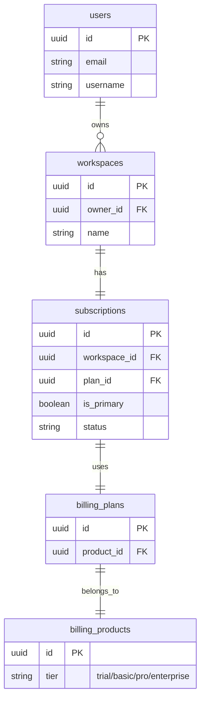
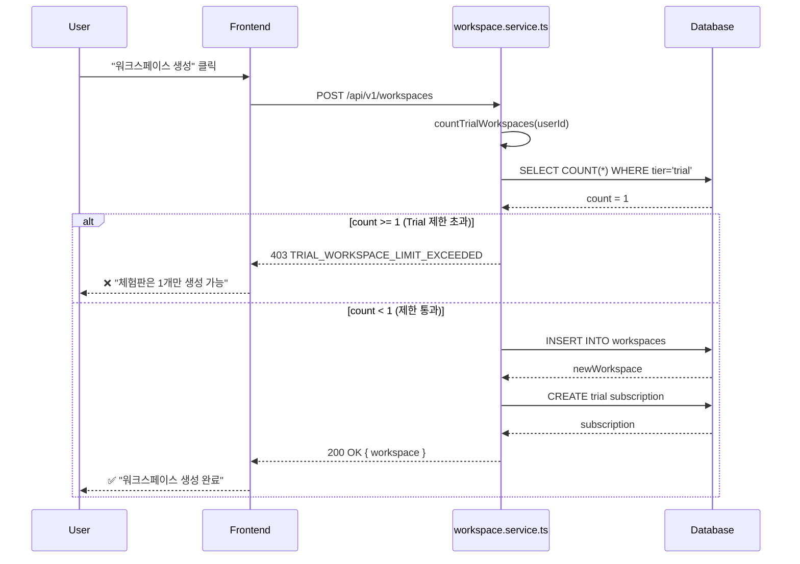

# 체험판 워크스페이스 생성 제한 구현 계획

## 개요

체험판(Trial) 사용자가 추가 워크스페이스를 무제한 생성하는 것을 방지하고, Trial 구독당 워크스페이스 1개로 제한합니다.

## 문제 정의

### 현재 상황
- 사용자가 `createWorkspace` API를 호출하면 무제한으로 워크스페이스 생성 가능
- 각 워크스페이스마다 자동으로 Trial 구독이 생성됨
- 한 사용자가 여러 Trial 워크스페이스를 만들어 체험판 혜택을 반복 사용 가능

### 문제점
- Trial 구독 남용 가능성
- 무료 리소스 과다 사용
- 비즈니스 모델 손실

## 해결 방안

### 제한 정책
- **체험판(Trial) 사용자**: 워크스페이스 **1개만** 생성 가능
- **유료(Basic/Pro/Enterprise) 사용자**: 제한 없음

### 검증 시점
`createWorkspace` 함수 실행 **시작 시점**에 체크

## 아키텍처

### 데이터베이스 구조



### 체험판 워크스페이스 확인 쿼리

```sql
SELECT COUNT(*) as trial_workspace_count
FROM workspaces w
INNER JOIN subscriptions s ON w.id = s.workspace_id AND s.is_primary = true
INNER JOIN billing_plans pl ON s.plan_id = pl.id
INNER JOIN billing_products p ON pl.product_id = p.id
WHERE w.owner_id = :userId
  AND p.tier = 'trial'
  AND w.is_active = true
```

## 구현 상세

### 1. Helper 함수 추가 (`workspace.service.ts`)

#### `countTrialWorkspaces(userId: string)`

```typescript
/**
 * 사용자가 소유한 Trial 워크스페이스 개수 조회
 *
 * @param userId - 사용자 ID
 * @returns Trial tier인 활성 워크스페이스 개수
 */
async function countTrialWorkspaces(userId: string): Promise<number> {
  const result = await db
    .select({ count: count() })
    .from(workspaces)
    .innerJoin(
      subscriptions,
      and(
        eq(workspaces.id, subscriptions.workspaceId),
        eq(subscriptions.isPrimary, true)
      )
    )
    .innerJoin(billingPlans, eq(subscriptions.planId, billingPlans.id))
    .innerJoin(billingProducts, eq(billingPlans.productId, billingProducts.id))
    .where(
      and(
        eq(workspaces.ownerId, userId),
        eq(billingProducts.tier, "trial"),
        eq(workspaces.isActive, true)
      )
    )

  return result[0]?.count || 0
}
```

### 2. `createWorkspace` 함수 수정

#### 수정 전
```typescript
export async function createWorkspace(data: {
  name: string
  // ... other fields
}) {
  const [newWorkspace] = await db
    .insert(workspaces)
    .values({...})
    .returning({...})

  // ... 이후 로직
}
```

#### 수정 후
```typescript
export async function createWorkspace(data: {
  name: string
  description?: string
  ownerId: string
  // ... other fields
}) {
  // ✅ 체험판 워크스페이스 제한 체크
  const trialCount = await countTrialWorkspaces(data.ownerId)

  if (trialCount >= 1) {
    throw new Error(
      "TRIAL_WORKSPACE_LIMIT_EXCEEDED: Trial users can only create 1 workspace. " +
      "Please upgrade your subscription to create more workspaces."
    )
  }

  // 기존 로직
  const [newWorkspace] = await db
    .insert(workspaces)
    .values({...})
    .returning({...})

  // ...
}
```

### 3. 에러 처리

#### 백엔드 에러 응답
```json
{
  "error": "TRIAL_WORKSPACE_LIMIT_EXCEEDED",
  "message": "Trial users can only create 1 workspace. Please upgrade your subscription to create more workspaces.",
  "statusCode": 403
}
```

#### 프론트엔드 에러 처리

위치: `admin/src/lib/api/hooks/workspaces.ts` (createWorkspace mutation)

```typescript
export function useCreateWorkspace() {
  return useMutation({
    mutationFn: (data) => workspacesApi.create(data),
    onError: (error: any) => {
      if (error?.message?.includes('TRIAL_WORKSPACE_LIMIT_EXCEEDED')) {
        toast.error(
          isKorean
            ? "체험판 사용자는 워크스페이스를 1개만 생성할 수 있습니다. 유료 플랜으로 업그레이드해주세요."
            : "Trial users can only create 1 workspace. Please upgrade to create more."
        )
      } else {
        toast.error(
          isKorean
            ? "워크스페이스 생성에 실패했습니다."
            : "Failed to create workspace."
        )
      }
    }
  })
}
```

## 흐름도



## 테스트 시나리오

### 1. Trial 사용자 - 첫 번째 워크스페이스
- **Given**: Trial 구독 워크스페이스 0개
- **When**: 워크스페이스 생성 요청
- **Then**: ✅ 생성 성공

### 2. Trial 사용자 - 두 번째 워크스페이스 시도
- **Given**: Trial 구독 워크스페이스 1개 존재
- **When**: 워크스페이스 생성 요청
- **Then**: ❌ 403 에러 반환, "TRIAL_WORKSPACE_LIMIT_EXCEEDED"

### 3. 유료 사용자 - 여러 워크스페이스
- **Given**: Basic/Pro/Enterprise 구독
- **When**: 워크스페이스 생성 요청
- **Then**: ✅ 제한 없이 생성 성공

### 4. Trial → 유료 업그레이드 후
- **Given**: Trial 구독이었던 워크스페이스를 Pro로 업그레이드
- **When**: 새 워크스페이스 생성 요청
- **Then**: ✅ 생성 성공 (기존 워크스페이스가 더 이상 trial이 아님)

### 5. 비활성화된 Trial 워크스페이스
- **Given**: Trial 워크스페이스 1개, but `is_active = false`
- **When**: 워크스페이스 생성 요청
- **Then**: ✅ 생성 성공 (비활성화된 것은 카운트 안함)

## 구현 순서

1. ✅ 계획 문서 작성
2. 🔄 `countTrialWorkspaces` 헬퍼 함수 구현
3. 🔄 `createWorkspace` 함수에 제한 로직 추가
4. 🔄 에러 메시지 다국어 지원
5. 🔄 프론트엔드 에러 처리 개선
6. 🔄 테스트 시나리오 실행
7. 🔄 커밋 및 PR 생성

## 주의사항

1. **is_primary = true 조건**: 워크스페이스당 여러 구독이 있을 수 있으므로 primary 구독만 확인
2. **is_active = true 조건**: 삭제되거나 비활성화된 워크스페이스는 카운트하지 않음
3. **구독 상태 무관**: `subscriptions.status`는 체크하지 않음 (trialing, active, canceled 모두 포함)
4. **에러 메시지 명확성**: 사용자가 업그레이드 방법을 알 수 있도록 안내

## 향후 개선 사항

1. **유료 플랜별 제한**: Basic은 3개, Pro는 10개 등 tier별 제한
2. **제한 관리 테이블**: `workspace_limits` 테이블로 동적 관리
3. **프론트엔드 사전 체크**: 생성 버튼 자체를 비활성화
4. **업그레이드 유도 UI**: 제한 초과 시 결제 페이지로 리다이렉트
5. **관리자 예외**: 관리자 역할은 제한 무시

## 관련 파일

### 백엔드
- `elysia-server/src/services/workspace.service.ts` (수정)
- `elysia-server/src/db/schema/billing.ts` (참조)
- `elysia-server/src/db/schema/workspaces.ts` (참조)

### 프론트엔드
- `admin/src/lib/api/hooks/workspaces.ts` (수정)
- `admin/src/lib/api/services/workspaces.ts` (참조)

---

**작성일**: 2025-12-24
**작성자**: Claude Code
**상태**: 준비 완료
