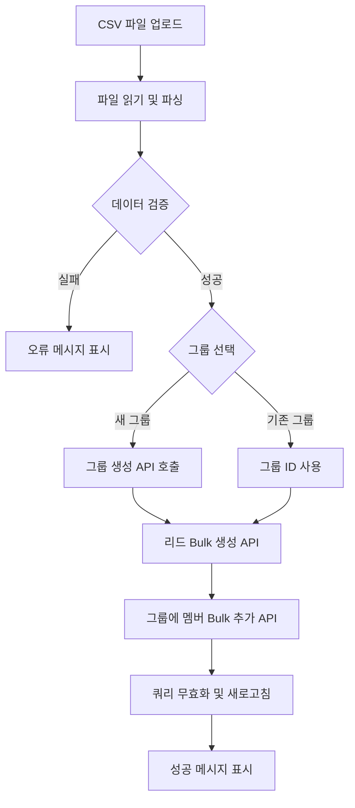
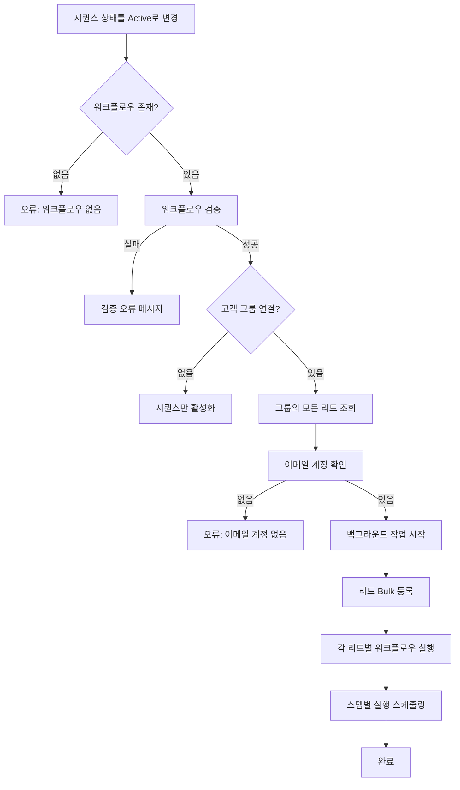
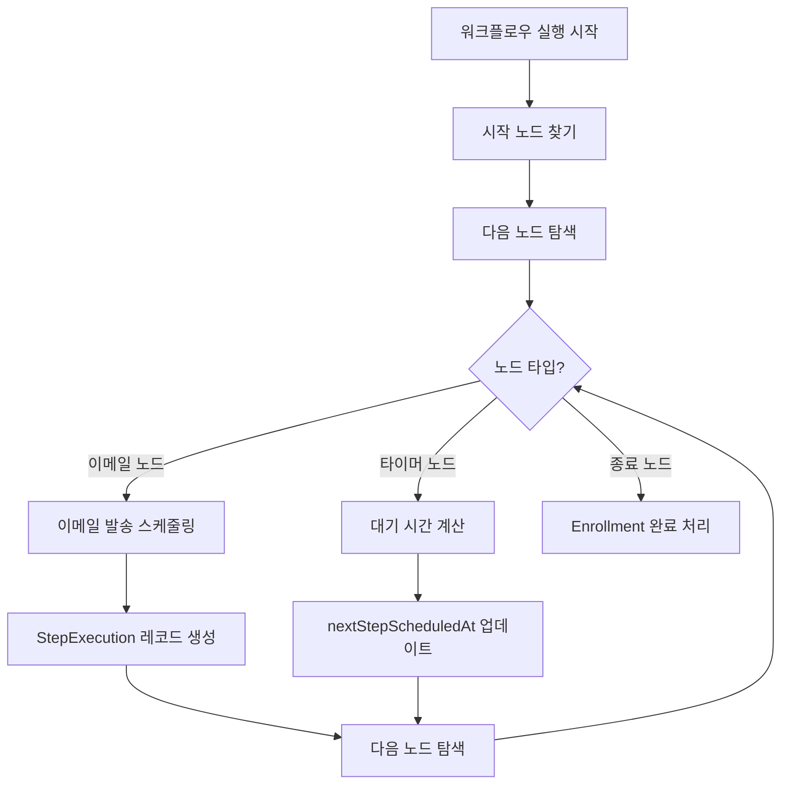

# 리드-그룹-시퀀스 관리 시스템 기획서

## 📋 목차
1. [개요](#개요)
2. [현재 구현 상태](#현재-구현-상태)
3. [시스템 아키텍처](#시스템-아키텍처)
4. [주요 기능 명세](#주요-기능-명세)
5. [데이터 플로우](#데이터-플로우)
6. [개선 방향](#개선-방향)

---

## 개요

### 목적
고객 리드 정보를 효율적으로 관리하고, 그룹화하여 자동화된 이메일 시퀀스를 통해 고객과 커뮤니케이션하는 시스템

### 주요 가치
- **리드 관리 자동화**: CSV 업로드를 통한 대량 리드 등록
- **세그먼트 기반 마케팅**: 고객 그룹별 타겟 마케팅
- **이메일 자동화**: 시퀀스를 통한 자동화된 이메일 발송

---

## 현재 구현 상태

### 1. Leads (리드) 관리
**위치**: `admin/src/pages/leads/`

#### 구현된 기능 ✅

##### 1.1 리드 입력
- **수동 입력** (`LeadForm.tsx`)
  - 회사 기본 정보 (회사명, 웹사이트, 업종, 위치)
  - 연락처 정보 (이메일, 전화번호 등 다중 입력)
  - 소셜 미디어 정보
  - 리드 상태 관리 (신규, 연락됨, 적격, 부적격 등)
  - 고객 그룹 선택 (생성 시)

- **CSV 업로드** (`LeadsPage.tsx:589-802`)
  ```typescript
  // CSV 업로드 프로세스
  1. CSV 템플릿 다운로드 제공
  2. 파일 업로드 및 파싱 (parseCSV)
  3. 데이터 검증 (validateCSVData)
  4. 그룹 선택/생성
     - 기존 그룹에 추가
     - 새 그룹 생성
  5. Bulk 생성 및 그룹 연결
  ```

##### 1.2 리드 조회
- 검색 기능 (회사명, 이메일, 웹사이트)
- 필터링
  - 워크스페이스별
  - 고객 그룹별
  - 상태별
  - 업종별
- 페이지네이션

##### 1.3 리드 편집/삭제
- 개별 수정
- Bulk 작업
  - 상태 일괄 변경
  - 업종 일괄 변경
  - 선택 삭제

#### API 엔드포인트
**위치**: `elysia-server/src/routes/leads.routes.ts`

```typescript
// 주요 API
GET    /api/v1/leads/search          // 검색 및 필터링
GET    /api/v1/leads/:id             // 개별 조회
POST   /api/v1/leads                 // 단일 생성
POST   /api/v1/leads/bulk            // CSV bulk 생성
PUT    /api/v1/leads/:id             // 수정
DELETE /api/v1/leads/:id             // 삭제

// Admin API
PUT    /api/v1/admin/leads/bulk/status          // Bulk 상태 변경
PUT    /api/v1/admin/leads/bulk/business-type   // Bulk 업종 변경
DELETE /api/v1/admin/leads/bulk                 // Bulk 삭제
```

#### 데이터베이스 스키마
**위치**: `elysia-server/src/db/schema/leads.ts`

```sql
leads {
  id: uuid PRIMARY KEY
  workspace_id: uuid (FK → workspaces)

  -- 회사 정보
  company_name: varchar(255)
  found_company_name: varchar(255)
  website_url: varchar(500)
  final_url: varchar(500)
  business_type: varchar(100)
  description: text

  -- 위치
  country: varchar(100)
  city: varchar(100)
  state: varchar(100)
  address: text

  -- 리드 관리
  lead_status: enum (new, contacted, qualified, unqualified, converted, lost, unsubscribed)
  lead_score: integer
  lead_source: varchar(100)
  notes: text

  -- 감사 필드
  created_by: uuid (FK → users)
  created_at: timestamp
  updated_at: timestamp
  last_contacted_at: timestamp
}
```

---

### 2. Customer Groups (고객 그룹)
**위치**: `admin/src/pages/customer-groups/`

#### 구현된 기능 ✅

##### 2.1 그룹 생성
- **정적 그룹** (Static Group)
  - 수동으로 멤버 추가/제거
  - CSV 업로드 시 자동 그룹 생성 및 리드 추가

- **동적 그룹** (Dynamic Group) - 스키마만 준비됨
  - 조건(criteria) 기반 자동 업데이트
  - 현재 UI 미구현

##### 2.2 그룹 관리
- 그룹 검색 및 필터링
- 그룹 수정/삭제
- 멤버 조회 (페이지네이션)

##### 2.3 멤버 관리
- **기존 리드 추가** (`AddMembersDialog.tsx`)
  - 워크스페이스의 리드 검색
  - 다중 선택 및 일괄 추가

- **CSV 업로드로 추가** (`LeadsPage.tsx`)
  - CSV 업로드 시 그룹 선택/생성
  - 리드 생성 후 자동으로 그룹에 추가

#### API 엔드포인트
**위치**: `elysia-server/src/routes/customer-groups.routes.ts`

```typescript
// 그룹 CRUD
GET    /api/v1/customer-groups/search                // 검색 및 필터링
GET    /api/v1/customer-groups/:id                   // 개별 조회
POST   /api/v1/customer-groups                       // 생성
PUT    /api/v1/customer-groups/:id                   // 수정
DELETE /api/v1/customer-groups/:id                   // 삭제

// 그룹별 조회
GET    /api/v1/customer-groups/workspace/:workspaceId  // 워크스페이스별
GET    /api/v1/customer-groups/:id/members             // 멤버 목록
GET    /api/v1/customer-groups/:id/members-with-emails // 이메일 포함 멤버

// 멤버 관리
POST   /api/v1/customer-groups/:id/members            // 멤버 추가
DELETE /api/v1/customer-groups/:id/members/:leadId    // 멤버 제거

// Admin API
DELETE /api/v1/admin/customer-groups/bulk                  // Bulk 삭제
POST   /api/v1/admin/customer-groups/:id/members/bulk      // Bulk 멤버 추가
DELETE /api/v1/admin/customer-groups/:id/members/bulk      // Bulk 멤버 제거
```

#### 데이터베이스 스키마
**위치**: `elysia-server/src/db/schema/customer-groups.ts`

```sql
customer_groups {
  id: uuid PRIMARY KEY
  workspace_id: uuid (FK → workspaces)
  name: varchar(255) NOT NULL
  description: text
  criteria: jsonb              -- 동적 그룹 조건 (미사용)
  is_dynamic: boolean DEFAULT false

  created_by: uuid (FK → users)
  created_at: timestamp
  updated_at: timestamp
}

customer_group_members {
  id: uuid PRIMARY KEY
  group_id: uuid (FK → customer_groups, CASCADE)
  lead_id: uuid (FK → leads, CASCADE)

  added_by: uuid (FK → users)
  added_at: timestamp
}
```

---

### 3. Sequences (시퀀스)
**위치**: `admin/src/pages/sequences/`

#### 구현된 기능 ✅

##### 3.1 시퀀스 생성 및 관리
- 시퀀스 기본 정보 (이름, 설명)
- 상태 관리 (초안, 활성, 일시정지, 보관)
- **고객 그룹 연결** (customerGroupId)
- 워크플로우 디자이너 (`SequenceDesigner.tsx`)
  - React Flow 기반 비주얼 에디터
  - 시작 노드, 이메일 노드, 타이머 노드

##### 3.2 리드 등록 (`EnrollLeadsDialog.tsx`)
```typescript
// 등록 프로세스
1. 시퀀스 선택
2. 연결된 고객 그룹의 리드 자동 로드
3. 발송 이메일 계정 선택
4. Bulk 등록 및 스케줄링
   - sequenceEnrollments 레코드 생성
   - 첫 번째 스텝 즉시 또는 예약 발송
   - 이후 스텝 자동 스케줄링
```

##### 3.3 자동 실행
**위치**: `elysia-server/src/routes/sequences.routes.ts:188-242`

```typescript
// 시퀀스 활성화 시
1. 워크플로우 검증
2. 고객 그룹의 모든 리드 자동 등록
3. 백그라운드에서 워크플로우 실행 시작
4. 각 리드별로 독립적인 실행 흐름
```

##### 3.4 실행 모니터링
- 등록 현황 조회 (`SequenceEnrollmentsTable`)
  - 등록된 리드 목록
  - 현재 진행 상태
  - 발송 이력
- 스텝 실행 이력
  - 스케줄 시간
  - 실행 결과
  - 오류 메시지

#### API 엔드포인트
**위치**: `elysia-server/src/routes/sequences.routes.ts`

```typescript
// 시퀀스 CRUD
GET    /api/v1/sequences/search       // 검색 및 필터링
GET    /api/v1/sequences/:id          // 개별 조회
POST   /api/v1/sequences              // 생성 (고객그룹 필수)
PUT    /api/v1/sequences/:id          // 수정 (활성화 시 자동 등록)
DELETE /api/v1/sequences/:id          // 삭제

// 시퀀스 스텝
GET    /api/v1/sequences/:id/steps                // 스텝 목록
POST   /api/v1/sequences/:id/steps                // 스텝 추가
PUT    /api/v1/sequences/:id/steps/:stepId        // 스텝 수정
DELETE /api/v1/sequences/:id/steps/:stepId        // 스텝 삭제

// 등록 관리
GET    /api/v1/sequences/:id/enrollments          // 등록 목록
POST   /api/v1/sequences/:id/enrollments          // 개별 등록
PATCH  /api/v1/sequences/:id/enrollments/:enrollmentId/status  // 상태 변경

// Admin API
PUT    /api/v1/admin/sequences/bulk/status                           // Bulk 상태 변경
DELETE /api/v1/admin/sequences/bulk                                  // Bulk 삭제
POST   /api/v1/admin/sequences/:id/enrollments/bulk-with-scheduling  // Bulk 등록
PUT    /api/v1/admin/sequences/enrollments/bulk/unenroll            // Bulk 해지
```

#### 데이터베이스 스키마
**위치**: `elysia-server/src/db/schema/sequences.ts`

```sql
sequences {
  id: uuid PRIMARY KEY
  workspace_id: uuid (FK → workspaces)
  customer_group_id: uuid (FK → customer_groups) -- ⭐ 그룹 연결

  name: varchar(255) NOT NULL
  description: text
  workflow_data: text              -- React Flow 워크플로우 JSON
  status: enum (draft, active, paused, archived)

  created_by: uuid (FK → users)
  created_at: timestamp
  updated_at: timestamp
}

sequence_steps {
  id: uuid PRIMARY KEY
  sequence_id: uuid (FK → sequences, CASCADE)

  step_order: integer NOT NULL
  delay_days: integer DEFAULT 0
  email_subject: varchar(500) NOT NULL
  email_body_text: text
  email_body_html: text
  email_template_id: uuid (FK → email_templates)

  created_at: timestamp
  updated_at: timestamp
}

sequence_enrollments {
  id: uuid PRIMARY KEY
  sequence_id: uuid (FK → sequences, CASCADE)
  lead_id: uuid (FK → leads, CASCADE)
  user_email_account_id: uuid (FK → user_email_accounts)

  current_step_order: integer DEFAULT 0
  status: enum (active, paused, completed, stopped, bounced, unsubscribed)

  enrolled_by: uuid (FK → users)
  enrolled_at: timestamp
  first_email_sent_at: timestamp
  last_email_sent_at: timestamp
  completed_at: timestamp
  stopped_at: timestamp
  next_step_scheduled_at: timestamp
}

sequence_step_executions {
  id: uuid PRIMARY KEY
  enrollment_id: uuid (FK → sequence_enrollments, CASCADE)
  step_id: uuid (FK → sequence_steps)

  step_order: integer NOT NULL
  status: enum (pending, scheduled, sent, failed, skipped)
  scheduled_at: timestamp NOT NULL
  executed_at: timestamp
  error_message: text
  email_id: uuid (FK → emails)

  created_at: timestamp
}
```

---

## 시스템 아키텍처

### 전체 구조
```
┌─────────────────────────────────────────────────────────────┐
│                        Admin Frontend                        │
│                     (React + TanStack Query)                 │
└─────────────────────────────────────────────────────────────┘
                              ↓ REST API
┌─────────────────────────────────────────────────────────────┐
│                      Elysia Server (BunJS)                   │
│  ┌──────────────┐  ┌──────────────┐  ┌──────────────┐      │
│  │ Leads Routes │  │ Groups Routes│  │Sequence Route│      │
│  └──────────────┘  └──────────────┘  └──────────────┘      │
│  ┌──────────────┐  ┌──────────────┐  ┌──────────────┐      │
│  │ Lead Service │  │ Group Service│  │Sequence Svc  │      │
│  └──────────────┘  └──────────────┘  └──────────────┘      │
└─────────────────────────────────────────────────────────────┘
                              ↓ Drizzle ORM
┌─────────────────────────────────────────────────────────────┐
│                      PostgreSQL Database                     │
│  ┌──────┐  ┌────────────┐  ┌──────────┐  ┌──────────┐      │
│  │Leads │→→│Group Members│←←│  Groups  │←─│Sequences │      │
│  └──────┘  └────────────┘  └──────────┘  └──────────┘      │
└─────────────────────────────────────────────────────────────┘
```

### 데이터 관계
```
Workspaces (1) ──→ (N) Leads
                   ↓
                   │
                   ↓
Workspaces (1) ──→ (N) Customer Groups
                   ↓               ↓
                   │               │
                   ↓               ↓ (연결)
                   └───→ (N:M) ←───┘
                   Group Members

Customer Groups (1) ──→ (N) Sequences
                          ↓
                          │
                          ↓ (등록)
Leads ──────────────→ Sequence Enrollments
                          ↓
                          │
                          ↓
                    Step Executions
```

---

## 주요 기능 명세

### Use Case 1: CSV로 리드 대량 등록 및 그룹 생성

#### 사용자 시나리오
```
1. 사용자가 리드 페이지에서 "CSV 업로드" 버튼 클릭
2. CSV 템플릿 다운로드 (선택사항)
3. CSV 파일 선택 및 업로드
4. 시스템이 CSV 파싱 및 검증
5. 그룹 선택
   - 기존 그룹 선택 OR
   - 새 그룹 이름 입력
6. "리드 추가" 버튼 클릭
7. 시스템이 리드 생성 및 그룹에 추가
8. 성공 메시지 표시
```

#### 구현 코드 참조
- **파일 업로드**: `LeadsPage.tsx:260-293`
- **CSV 처리**: `admin/src/lib/csv-utils.ts`
- **API 호출**: `LeadsPage.tsx:308-364`

#### 데이터 플로우
```typescript
// 1. CSV 파싱
const parsedData: LeadCSVData[] = parseCSV(csvText)

// 2. 검증
const validation = validateCSVData(parsedData)

// 3. 그룹 생성 (선택 시)
const newGroup = await createCustomerGroup({
  workspaceId,
  name: newGroupName,
  description,
  isDynamic: false
})

// 4. 리드 bulk 생성
const createdLeads = await leadsApi.createFromCSV({
  workspaceId,
  leads: csvData
})

// 5. 그룹에 멤버 추가
await customerGroupsApi.bulkAddMembers(
  targetGroupId,
  leadIds
)
```

---

### Use Case 2: 그룹을 시퀀스에 연결하고 자동 이메일 발송

#### 사용자 시나리오
```
1. 시퀀스 생성
   - 시퀀스 이름, 설명 입력
   - 고객 그룹 선택 (필수)
   - 상태: 초안(draft)

2. 워크플로우 디자인
   - 시작 노드 추가
   - 이메일 노드 추가 (제목, 본문)
   - 타이머 노드 추가 (대기 시간)
   - 저장

3. 시퀀스 활성화
   - 상태를 "활성(active)"로 변경
   - 시스템이 자동으로:
     a. 워크플로우 검증
     b. 고객 그룹의 모든 리드를 시퀀스에 등록
     c. 워크플로우 실행 시작

4. 모니터링
   - 등록 현황 탭에서 진행 상태 확인
   - 각 리드별 발송 이력 확인
```

#### 구현 코드 참조
- **시퀀스 생성**: `SequenceForm.tsx`
- **워크플로우 디자이너**: `sequences/designer/SequenceDesigner.tsx`
- **자동 등록 로직**: `sequences.routes.ts:188-242`
- **등록 다이얼로그**: `EnrollLeadsDialog.tsx`

#### 자동 실행 로직
```typescript
// sequences.routes.ts PUT /:id
if (body.status === 'active') {
  // 1. 워크플로우 검증
  const validation = parseAndValidateWorkflow(workflowData)
  if (!validation.valid) {
    return error("워크플로우 검증 실패")
  }

  // 2. 고객 그룹의 리드 자동 등록
  if (currentSequence.customerGroupId) {
    // 백그라운드 실행
    (async () => {
      // 리드 bulk 등록
      const enrollResult = await bulkEnrollInWorkflow({
        sequenceId,
        customerGroupId,
        userEmailAccountId
      })

      // 각 리드별 워크플로우 실행
      for (const enrollment of enrollResult.enrollments) {
        await executeWorkflow(enrollment.id)
      }
    })()
  }
}
```

---

### Use Case 3: 특정 리드만 선택하여 시퀀스 등록

#### 사용자 시나리오
```
1. 시퀀스 페이지에서 활성화된 시퀀스 선택
2. "리드 등록" 버튼 클릭
3. EnrollLeadsDialog 열림
   - 연결된 고객 그룹의 리드 자동 표시
   - 등록 대상 리드 수 표시
4. 발송 이메일 계정 선택
5. "N명 등록 및 실행" 버튼 클릭
6. 시스템이 선택된 리드들을 시퀀스에 등록
7. 즉시 워크플로우 실행 시작
```

#### 구현 코드 참조
- **등록 다이얼로그**: `EnrollLeadsDialog.tsx`
- **API 호출**: `useBulkEnrollWithScheduling` hook
- **백엔드 로직**: `sequences.routes.ts:524-550`

---

## 데이터 플로우

### 1. CSV 업로드 → 그룹 생성 플로우



### 2. 시퀀스 활성화 → 자동 실행 플로우



### 3. 리드별 워크플로우 실행 플로우



---

## 개선 방향

### 1. 단기 개선 사항 (1-2주)

#### 1.1 사용자 경험 개선
- [ ] **리드 페이지 개선**
  - CSV 업로드 성공 시 생성된 리드로 자동 필터링
  - 업로드 진행률 표시
  - 중복 리드 처리 로직 추가

- [ ] **그룹 페이지 개선**
  - 그룹 카드에 시퀀스 연결 상태 표시
  - 그룹에서 직접 시퀀스 생성 버튼 추가
  - 그룹 멤버 미리보기 (상위 5개)

- [ ] **시퀀스 페이지 개선**
  - 시퀀스 카드에 등록된 리드 수 표시
  - 마지막 실행 시간 표시
  - 성공률 표시 (발송 성공 / 전체)

#### 1.2 기능 개선
- [ ] **리드 중복 체크**
  - 이메일 또는 웹사이트 기준 중복 검사
  - CSV 업로드 시 중복 처리 옵션 (건너뛰기/업데이트/에러)

- [ ] **그룹 필터 개선**
  - 리드 페이지에서 여러 그룹 동시 필터링 (OR 조건)
  - 그룹에 속하지 않은 리드 필터링

- [ ] **시퀀스 템플릿**
  - 자주 사용하는 워크플로우를 템플릿으로 저장
  - 템플릿 갤러리 (웰컴 시퀀스, 팔로업 시퀀스 등)

### 2. 중기 개선 사항 (1-2개월)

#### 2.1 동적 그룹 (Dynamic Groups)
**현재 상태**: 스키마만 준비됨 (`customer_groups.criteria`, `is_dynamic`)

**구현 계획**:
```typescript
// 조건 예시
{
  criteria: {
    rules: [
      { field: 'leadStatus', operator: 'equals', value: 'qualified' },
      { field: 'leadScore', operator: 'greaterThan', value: 70 },
      { field: 'businessType', operator: 'contains', value: 'IT' }
    ],
    combinator: 'AND' // OR
  }
}
```

- [ ] 조건 빌더 UI 구현
- [ ] 백엔드 쿼리 빌더 구현
- [ ] 자동 업데이트 크론 작업
- [ ] 동적 그룹 미리보기 기능

#### 2.2 리드 스코어링 자동화
**현재**: 수동 입력만 가능

**구현 계획**:
- [ ] 스코어링 규칙 설정 UI
  - 웹사이트 방문 횟수
  - 이메일 오픈률
  - 링크 클릭률
  - 업종별 가중치
- [ ] 자동 스코어 계산 및 업데이트
- [ ] 스코어 변화 이력 추적

#### 2.3 시퀀스 분기 및 조건부 실행
**현재**: 선형 워크플로우만 지원

**구현 계획**:
- [ ] 조건 노드 추가
  - 이메일 오픈 여부
  - 링크 클릭 여부
  - 리드 스코어 기준
- [ ] A/B 테스트 노드
- [ ] 대기 시간 동적 조정

### 3. 장기 개선 사항 (3-6개월)

#### 3.1 고급 분석 및 리포팅
- [ ] 대시보드
  - 리드 전환율
  - 시퀀스별 성과
  - 그룹별 인사이트
- [ ] 이메일 히트맵
- [ ] 코호트 분석
- [ ] 예측 분석 (ML)

#### 3.2 통합 기능
- [ ] CRM 통합 (Salesforce, HubSpot)
- [ ] 결제 시스템 연동
- [ ] 웹훅 및 API 자동화
- [ ] Zapier/Make 통합

#### 3.3 협업 기능
- [ ] 팀원 간 리드 할당
- [ ] 댓글 및 노트 공유
- [ ] 승인 워크플로우
- [ ] 활동 로그 및 감사 추적

---

## 구현 우선순위

### Phase 1: 핵심 기능 안정화 (현재)
✅ 리드 CRUD
✅ CSV 업로드
✅ 그룹 관리
✅ 시퀀스 생성 및 실행
✅ 자동 이메일 발송

### Phase 2: 사용자 경험 개선 (다음 2주)
- [ ] UI/UX 개선
- [ ] 중복 리드 처리
- [ ] 그룹 필터 개선
- [ ] 시퀀스 템플릿

### Phase 3: 고급 기능 추가 (다음 1-2개월)
- [ ] 동적 그룹
- [ ] 리드 스코어링
- [ ] 조건부 워크플로우
- [ ] 기본 분석

### Phase 4: 확장 및 통합 (장기)
- [ ] 고급 분석
- [ ] 외부 통합
- [ ] 협업 기능
- [ ] 엔터프라이즈 기능

---

## 기술 스택

### Frontend
- **Framework**: React 18 + TypeScript
- **State Management**: TanStack Query (React Query)
- **UI Components**: shadcn/ui + Tailwind CSS
- **Form**: React Hook Form
- **Routing**: React Router
- **Workflow Editor**: React Flow

### Backend
- **Runtime**: Bun
- **Framework**: Elysia (타입 안전 REST API)
- **Database**: PostgreSQL
- **ORM**: Drizzle ORM
- **Validation**: Elysia 내장 타입 검증
- **Logger**: Pino

### Infrastructure
- **Database**: PostgreSQL (Drizzle ORM)
- **Email**: SendGrid / SMTP
- **File Storage**: 로컬 / S3 (선택)
- **Background Jobs**: Bun 타이머 / BullMQ (선택)

---

## API 엔드포인트 요약

### Leads
```
GET    /api/v1/leads/search                         검색 및 필터링
GET    /api/v1/leads/:id                            개별 조회
POST   /api/v1/leads                                단일 생성
POST   /api/v1/leads/bulk                           CSV bulk 생성
PUT    /api/v1/leads/:id                            수정
DELETE /api/v1/leads/:id                            삭제

PUT    /api/v1/admin/leads/bulk/status              Bulk 상태 변경
PUT    /api/v1/admin/leads/bulk/business-type       Bulk 업종 변경
DELETE /api/v1/admin/leads/bulk                     Bulk 삭제
```

### Customer Groups
```
GET    /api/v1/customer-groups/search               검색 및 필터링
GET    /api/v1/customer-groups/:id                  개별 조회
POST   /api/v1/customer-groups                      생성
PUT    /api/v1/customer-groups/:id                  수정
DELETE /api/v1/customer-groups/:id                  삭제

GET    /api/v1/customer-groups/:id/members          멤버 목록
POST   /api/v1/customer-groups/:id/members          멤버 추가
DELETE /api/v1/customer-groups/:id/members/:leadId  멤버 제거

POST   /api/v1/admin/customer-groups/:id/members/bulk      Bulk 멤버 추가
DELETE /api/v1/admin/customer-groups/:id/members/bulk      Bulk 멤버 제거
```

### Sequences
```
GET    /api/v1/sequences/search                     검색 및 필터링
GET    /api/v1/sequences/:id                        개별 조회
POST   /api/v1/sequences                            생성
PUT    /api/v1/sequences/:id                        수정 (활성화 시 자동 등록)
DELETE /api/v1/sequences/:id                        삭제

GET    /api/v1/sequences/:id/enrollments            등록 목록
POST   /api/v1/sequences/:id/enrollments            개별 등록

POST   /api/v1/admin/sequences/:id/enrollments/bulk-with-scheduling  Bulk 등록
PUT    /api/v1/admin/sequences/enrollments/bulk/unenroll            Bulk 해지
```

---

## 파일 구조

### Frontend
```
admin/src/pages/
├── leads/
│   ├── LeadsPage.tsx                  # 메인 페이지
│   ├── LeadForm.tsx                   # 리드 생성/수정 폼
│   ├── LeadsTableWithPagination.tsx   # 테이블
│   ├── LeadFilters.tsx                # 필터
│   └── BulkActionModal.tsx            # Bulk 작업 모달
│
├── customer-groups/
│   ├── CustomerGroupsPage.tsx         # 메인 페이지
│   ├── CustomerGroupForm.tsx          # 그룹 생성/수정 폼
│   ├── CustomerGroupsTableWithPagination.tsx
│   ├── AddMembersDialog.tsx           # 멤버 추가 다이얼로그
│   └── BulkActionModal.tsx
│
└── sequences/
    ├── SequencesPage.tsx              # 메인 페이지
    ├── SequenceForm.tsx               # 시퀀스 생성/수정 폼
    ├── SequencesTableWithPagination.tsx
    ├── EnrollLeadsDialog.tsx          # 리드 등록 다이얼로그
    ├── SequenceDetailTabs.tsx         # 상세 탭
    ├── SequenceEnrollmentsTable.tsx   # 등록 현황
    └── designer/
        ├── SequenceDesigner.tsx       # 워크플로우 에디터
        └── nodes/
            ├── StartNode.tsx
            ├── EmailDraftNode.tsx
            ├── TimerNode.tsx
            └── CommentNode.tsx
```

### Backend
```
elysia-server/src/
├── db/schema/
│   ├── leads.ts                       # 리드 스키마
│   ├── customer-groups.ts             # 그룹 스키마
│   └── sequences.ts                   # 시퀀스 스키마
│
├── routes/
│   ├── leads.routes.ts                # 리드 API
│   ├── customer-groups.routes.ts      # 그룹 API
│   └── sequences.routes.ts            # 시퀀스 API
│
└── services/
    ├── lead.service.ts                # 리드 비즈니스 로직
    ├── customer-group.service.ts      # 그룹 비즈니스 로직
    ├── sequence.service.ts            # 시퀀스 비즈니스 로직
    ├── workflow-validation.service.ts # 워크플로우 검증
    └── workflow-execution.service.ts  # 워크플로우 실행
```

---

## 결론

현재 시스템은 **리드 입력 → 그룹화 → 시퀀스 연결 → 자동 이메일 발송**의 핵심 플로우가 완성되어 있습니다.

### 강점
✅ CSV 업로드를 통한 대량 리드 등록
✅ 그룹 기반 세그먼트 관리
✅ 시퀀스와 그룹의 명확한 연결
✅ 시퀀스 활성화 시 자동 리드 등록 및 실행
✅ 워크플로우 비주얼 에디터
✅ 타입 안전한 백엔드 API (Elysia)

### 개선 필요
⚠️ 동적 그룹 기능 미구현
⚠️ 리드 중복 처리 로직 필요
⚠️ 시퀀스 분기 및 조건부 실행 미지원
⚠️ 분석 및 리포팅 기능 부족
⚠️ 협업 기능 없음

### 다음 스텝
1. **단기**: UI/UX 개선 및 중복 처리 로직 추가
2. **중기**: 동적 그룹, 리드 스코어링 자동화
3. **장기**: 고급 분석, 외부 통합, 협업 기능

---

**문서 버전**: 1.0
**작성일**: 2025-10-10
**작성자**: Claude Code
