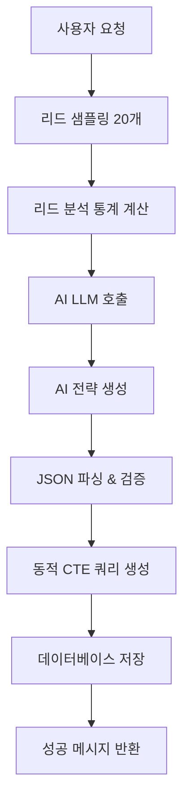

# 시퀀스 생성 프롬프트 정리

## 개요

AI 챗봇의 시퀀스 생성 기능은 고객 그룹의 리드 데이터를 분석하여 최적화된 이메일 시퀀스를 **AI가 완전히 자동으로** 생성합니다.

**✨ 주요 특징:**
- 🤖 **AI 기반 동적 생성**: 하드코딩 없이 LLM이 모든 내용을 생성
- 📊 **데이터 기반 최적화**: 20개 샘플 리드 분석 후 맞춤 전략 생성
- ⏰ **스마트 타이밍**: 업종과 리드 스코어에 따른 최적 발송 시간
- 📧 **유연한 스텝 수**: 2-5개 스텝을 자동으로 결정
- 🎯 **개인화**: {{contact_name}}, {{company_name}} 등 변수 자동 삽입

**관련 파일:**
- `src/services/chatbot/nodes/sequence-generation.ts` (메인 로직)
- `src/services/chatbot/prompts.ts` (AI 프롬프트)

---

## 1. AI 기반 시간 설정 프롬프트

### AI가 결정하는 타이밍 전략

AI는 다음 요소를 고려하여 최적의 발송 시간을 자동으로 결정합니다:

**📊 고려 요소:**

⚠️ **중요: 첫 메일 발송 정책 (KST 기준)**
- **첫 번째 이메일(Step 1)은 시퀀스 생성 시점으로부터 2분 뒤에 발송됩니다**
- **시스템이 자동으로 현재 KST 시간을 계산하여 +2분 설정**
  - 예: 시퀀스 생성 시각이 14:30 KST → Step 1은 14:32 KST에 발송
- delay_days: 항상 0 (당일 발송)
- scheduled_hour/minute: AI가 생성한 값은 무시되고 **자동 계산된 값으로 덮어써짐**
- **모든 시간은 KST (Korea Standard Time, Asia/Seoul) 기준**

```typescript
// 자동 계산 로직 (src/services/chatbot/nodes/sequence-generation.ts:340-361)
const now = new Date()
const kstOffset = 9 * 60 * 60 * 1000 // KST is UTC+9
const kstNow = new Date(now.getTime() + kstOffset)
const kstPlus2Min = new Date(kstNow.getTime() + 2 * 60 * 1000)

const step1Hour = kstPlus2Min.getUTCHours()
const step1Minute = kstPlus2Min.getUTCMinutes()

aiStrategy.steps[0].scheduled_hour = step1Hour
aiStrategy.steps[0].scheduled_minute = step1Minute
```

1. **리드 스코어**
   - High (>70): 짧은 주기 (2-3일 간격) - 이미 관심도가 높음
   - Medium (40-70): 표준 주기 (3-5일 간격) - 일반적인 육성 필요
   - Low (<40): 긴 주기 (5-7일 간격) - 많은 접점 필요

2. **업종 특성**
   - B2B: 주로 9-11 AM 또는 2-4 PM (업무 시간)
   - B2C: 저녁 시간대도 고려
   - 산업별 맞춤 시간

3. **회사 규모**
   - 대기업: 공식적인 업무 시간 선호
   - 중소기업: 유연한 시간대 가능

4. **지역/타임존**
   - 리드의 위치 정보 기반 자동 타임존 설정

### AI 프롬프트 예시

```typescript
// src/services/chatbot/prompts.ts:getAISequenceStrategyPrompt()

"3. **Timing Strategy:** For each step, determine:
   - **delay_days:** Days after previous step (Step 1 is always 0)
     * Short cycle (high score): 2-3 days between emails
     * Standard cycle: 3-5 days between emails
     * Long cycle (low score): 5-7 days between emails
   - **scheduled_hour:** Best time to send (0-23 in 24h format)
     * B2B: Typically 9-11 AM or 2-4 PM
     * Consider business type and region
   - **scheduled_minute:** Usually 0, 15, 30, or 45
   - **timezone:** Based on lead locations (default: Asia/Seoul)"
```

### AI 생성 예시

```json
{
  "steps": [
    {
      "step_order": 1,
      "delay_days": 0,
      "scheduled_hour": 9,
      "scheduled_minute": 0
    },
    {
      "step_order": 2,
      "delay_days": 3,
      "scheduled_hour": 10,
      "scheduled_minute": 30
    },
    {
      "step_order": 3,
      "delay_days": 5,
      "scheduled_hour": 14,
      "scheduled_minute": 0
    }
  ],
  "timezone": "Asia/Seoul"
}
```

### 데이터베이스 저장 방식

```sql
-- sequence_steps 테이블 구조
INSERT INTO sequence_steps (
  delay_days,        -- 이전 스텝으로부터 지연 일수
  scheduled_hour,    -- 발송 시간 (24시간 형식)
  scheduled_minute,  -- 발송 분
  timezone          -- 타임존
) VALUES (
  0,                -- Step 1: 즉시
  9,                -- 9 AM
  0,                -- :00분
  'Asia/Seoul'      -- KST
);
```

---

## 2. AI 기반 이메일 내용 생성 프롬프트

### 2.1 리드 분석 기반 전략

이메일 내용은 고객 그룹의 **20개 랜덤 샘플 리드**를 AI가 분석하여 **완전히 자동으로** 생성됩니다.

#### 분석 항목:

```typescript
// src/services/chatbot/nodes/sequence-generation.ts:analyzeLeadsAndGenerateStrategy()

// 1. 평균 리드 스코어
avgLeadScore = sum(lead_score) / count(leads)

// 2. 주요 비즈니스 타입 (최다 빈도)
dominantBusinessType = mostFrequent(leads.business_type)

// 3. 평균 회사 규모
avgCompanySize = average(leads.employee_count)

// 4. 회사 규모 카테고리
companySizeCategory = {
  avgCompanySize > 500  → "large enterprise"
  avgCompanySize > 100  → "mid-sized"
  avgCompanySize ≤ 100  → "small to medium"
}

// 5. 비즈니스 타입 포커스
businessTypeFocus = {
  uniqueTypes ≤ 2  → "Type1 and Type2"
  uniqueTypes > 2  → "various"
}
```

### 2.2 AI 프롬프트 구조

AI는 다음 가이드라인에 따라 이메일 시퀀스를 생성합니다:

#### **스텝 수 결정 (2-5개)**

```typescript
"1. **Number of Steps:** Determine optimal number of emails (2-5 steps)
   - High lead score (>70): Use 2-3 steps (they're warm, don't over-communicate)
   - Medium lead score (40-70): Use 3-4 steps (standard nurture sequence)
   - Low lead score (<40): Use 4-5 steps (need more touchpoints)"
```

#### **이메일 패턴**

```typescript
"4. **Email Sequence Pattern:**
   - Step 1: Introduction + Value Proposition
   - Step 2: Social Proof / Case Study / Problem-Solution
   - Step 3: Educational Content / Industry Insights
   - Step 4 (if needed): Urgency / Limited Offer
   - Step 5 (if needed): Final Touch / Breakup Email"
```

#### **톤 매칭**

```typescript
"5. **Tone Matching:**
   - Large Enterprise (>500 employees): Formal, data-driven, ROI-focused
   - Mid-sized (100-500): Professional yet approachable, results-focused
   - Small Business (<100): Friendly, solution-oriented, quick value"
```

### 2.3 AI 생성 예시

AI가 생성한 실제 이메일 예시 (SaaS 업종, 중소기업 타겟):

```json
{
  "strategy_summary": "3-step nurture sequence targeting mid-sized SaaS companies with educational approach",
  "recommended_steps": 3,
  "steps": [
    {
      "step_order": 1,
      "delay_days": 0,
      "scheduled_hour": 9,
      "scheduled_minute": 0,
      "email_subject": "Quick Win: Automate Your {{company_name}} Sales Process",
      "email_body": "Hi {{contact_name}},\n\nI noticed {{company_name}} is in the SaaS space and wanted to share a quick automation win that's helping similar companies close 30% more deals.\n\nWould you have 10 minutes this week for a quick demo?\n\nBest regards",
      "strategy_note": "Direct value proposition with specific metric"
    },
    {
      "step_order": 2,
      "delay_days": 3,
      "scheduled_hour": 10,
      "scheduled_minute": 30,
      "email_subject": "Case Study: How [Similar Company] Scaled Revenue 3x",
      "email_body": "Hi {{contact_name}},\n\nFollowing up on my previous email about automation for {{company_name}}.\n\nI wanted to share how a mid-sized SaaS company similar to yours used our platform to:\n• Reduce manual work by 15 hours/week\n• Increase lead conversion by 45%\n• Scale to 3x revenue in 8 months\n\nInterested in seeing how this applies to {{company_name}}?\n\nBest regards",
      "strategy_note": "Social proof with detailed metrics"
    },
    {
      "step_order": 3,
      "delay_days": 4,
      "scheduled_hour": 14,
      "scheduled_minute": 0,
      "email_subject": "Last note: Free SaaS Growth Playbook",
      "email_body": "Hi {{contact_name}},\n\nThis is my final email, but I wanted to leave you with something valuable.\n\nI've put together a free playbook specifically for mid-sized SaaS companies showing the exact automation framework that's working in 2024.\n\nNo strings attached - just practical tactics you can implement this week.\n\nWant me to send it over?\n\nBest regards",
      "strategy_note": "Soft breakup email with free value offer"
    }
  ],
  "personalization_tips": [
    "Include specific SaaS metrics (MRR, churn, CAC) in conversations",
    "Reference their product category if known",
    "Mention recent funding or growth news if available"
  ],
  "expected_performance": {
    "estimated_open_rate": "35-42%",
    "estimated_response_rate": "8-12%",
    "reasoning": "Mid-sized companies respond well to data-driven approaches. The 3-step sequence balances persistence with respect for their time."
  }
}
```

### 2.4 개인화 변수

AI가 자동으로 삽입하는 변수:
- `{{contact_name}}`: 담당자 이름
- `{{company_name}}`: 회사명
- 업종, 규모, 리드 스코어를 반영한 맞춤 내용

---

## 3. AI 기반 프롬프트 생성 플로우

### 3.1 전체 플로우



### 3.2 리드 샘플링

```sql
-- src/services/chatbot/nodes/sequence-generation.ts:analyzeLeadsAndGenerateStrategy()
-- 20개 랜덤 리드 샘플링
SELECT
  l.id,
  l.company_name,
  l.contact_name,
  l.business_type,
  l.employee_count,
  l.lead_score,
  l.lead_source,
  l.description,
  l.city,
  l.country
FROM leads l
INNER JOIN customer_group_members cgm ON cgm.lead_id = l.id
WHERE cgm.group_id = {{customerGroupId}}
  AND l.workspace_id = {{workspaceId}}
ORDER BY RANDOM()
LIMIT 20
```

### 3.3 AI 전략 생성 알고리즘

```typescript
/**
 * AI 기반 전략 생성 단계
 * src/services/chatbot/nodes/sequence-generation.ts:analyzeLeadsAndGenerateStrategy()
 */
async function generateSequenceStrategyWithAI(leadSamples: Lead[]) {
  // 1. 리드 특성 분석 (통계 계산)
  const avgLeadScore = calculateAverageScore(leadSamples)
  const dominantBusinessType = findMostFrequentType(leadSamples)
  const avgCompanySize = calculateAverageSize(leadSamples)
  const companySizeCategory = categorizeCompanySize(avgCompanySize)
  const businessTypeFocus = determineBusinessFocus(leadSamples)

  // 2. AI 프롬프트 생성
  const leadAnalysisData = {
    samples: leadSamples,
    avgLeadScore,
    dominantBusinessType,
    avgCompanySize,
    companySizeCategory,
    businessTypeFocus,
    customerGroupName,
    totalMembers: membersCount,
  }

  const strategyPrompt = getAISequenceStrategyPrompt(leadAnalysisData)

  // 3. LLM 호출 (gpt-4o-mini, temperature: 0.7)
  const response = await strategyLLM.invoke(strategyPrompt)
  const aiStrategyResponse = response.content as string

  // 4. JSON 파싱
  const aiStrategy = parseAIResponse(aiStrategyResponse)

  // 5. 검증 (2-5개 스텝)
  validateStrategy(aiStrategy)

  // 6. 내부 형식으로 변환
  return {
    ...leadAnalysis,
    strategy_summary: aiStrategy.strategy_summary,
    timezone: aiStrategy.timezone,
    recommended_steps: aiStrategy.recommended_steps,
    email_steps: aiStrategy.steps, // 동적 배열
    personalization_tips: aiStrategy.personalization_tips,
    expected_performance: aiStrategy.expected_performance,
  }
}
```

### 3.4 동적 CTE 쿼리 생성

**핵심:** AI가 생성한 스텝 수(2-5개)에 맞춰 CTE 쿼리를 동적으로 생성합니다.

```typescript
// src/services/chatbot/nodes/sequence-generation.ts:generateSequenceWithStrategy()

// 1. 시퀀스 생성 CTE
let cteQuery = `
WITH
new_sequence AS (
  INSERT INTO sequences (
    id, workspace_id, customer_group_id,
    name, description, status
  ) VALUES (
    gen_random_uuid(),
    '${workspaceId}',
    '${customerGroupId}',
    'AI-Generated Sequence for ${customerGroupName}',
    '${strategySummary}',
    'active'
  )
  RETURNING *
)`

// 2. 각 이메일 스텝 CTE 동적 생성
emailSteps.forEach((step, index) => {
  const stepNumber = index + 1
  cteQuery += `,

new_sequence_step_${stepNumber} AS (
  INSERT INTO sequence_steps (
    id, sequence_id, step_order, delay_days,
    scheduled_hour, scheduled_minute, timezone,
    email_subject, email_body_text
  ) SELECT
    gen_random_uuid(),
    id,
    ${step.step_order},
    ${step.delay_days},
    ${step.scheduled_hour},
    ${step.scheduled_minute},
    '${timezone}',
    '${step.email_subject}',
    E'${step.email_body.replace(/\n/g, "\\n")}' -- Escape newlines
  FROM new_sequence
  RETURNING *
)`
})

// 3. 모든 스텝 UNION ALL (동적)
const unionAllSteps = emailSteps
  .map((_, index) => `SELECT * FROM new_sequence_step_${index + 1}`)
  .join("\n      UNION ALL ")

// 4. 최종 SELECT
cteQuery += `
SELECT json_build_object(
  'sequence', (SELECT row_to_json(new_sequence.*) FROM new_sequence),
  'steps', (
    SELECT json_agg(row_to_json(steps.*) ORDER BY steps.step_order) FROM (
      ${unionAllSteps}
    ) steps
  ),
  'total_steps', ${emailSteps.length},
  'status', 'active'
) as result
`
```

**결과:**
- 2개 스텝이면 2개의 CTE 생성
- 5개 스텝이면 5개의 CTE 생성
- 완전히 동적!

---

## 4. 구현 완료 기능 ✅

### 4.1 ✅ LLM 기반 동적 생성 (구현 완료)

**상태:** ✅ 완료
**모델:** gpt-4o-mini (temperature: 0.7)

```typescript
// src/services/chatbot/nodes/sequence-generation.ts:analyzeLeadsAndGenerateStrategy()
const strategyLLM = new ChatOpenAI({
  model: "gpt-4o-mini",
  temperature: 0.7, // 마케팅 콘텐츠를 위한 창의성
})

const strategyPrompt = getAISequenceStrategyPrompt(leadAnalysisData)
const response = await strategyLLM.invoke(strategyPrompt)
```

**기능:**
- 리드 데이터 분석 기반 완전 자동 생성
- 2-5개 스텝 동적 결정
- 이메일 제목, 본문, 타이밍 모두 AI 생성
- 업종/규모/리드 스코어 기반 맞춤 전략

---

## 5. 향후 개선 방향

### 5.1 A/B 테스트 기능

```typescript
// TODO: 다양한 전략 변형 생성 및 테스트
interface StrategyVariant {
  variant_name: string
  subject: string
  body: string
  timing: EmailTiming
  test_percentage: number // 10-50%
}

// AI에게 2-3개의 변형을 생성하도록 요청
// 자동으로 트래픽 분할 및 성과 비교
```

### 5.2 성과 기반 학습

```typescript
// TODO: 이전 캠페인 성과를 학습하여 전략 개선
async function learnFromPastCampaigns(
  pastSequences: Sequence[],
  performanceMetrics: Metrics[]
) {
  // 1. 높은 성과를 낸 패턴 분석
  const successPatterns = analyzeTopPerformers(performanceMetrics)

  // 2. AI 프롬프트에 성공 패턴 추가
  const enhancedPrompt = `
    Based on past successful campaigns:
    - Best subject line patterns: ${successPatterns.subjects}
    - Optimal timing: ${successPatterns.timing}
    - High-performing content themes: ${successPatterns.themes}

    Generate a new sequence incorporating these insights.
  `

  // 3. 지속적인 개선
}
```

### 5.3 다국어 지원

```typescript
// TODO: 리드의 국가/언어에 따른 다국어 이메일 생성
const prompt = `
  Generate email sequence in ${leadLanguage} for ${leadCountry} audience.
  Consider cultural nuances and local business practices.
`
```

### 5.4 산업별 템플릿 라이브러리

```typescript
// TODO: 고성과 산업별 템플릿 자동 저장 및 재사용
interface IndustryTemplate {
  industry: string
  avg_open_rate: number
  avg_response_rate: number
  template: EmailSequenceStrategy
  success_count: number
}

// AI가 참고할 산업별 베스트 프랙티스 구축
```

---

## 5. 참고 정보

### 데이터베이스 스키마

```sql
-- sequences 테이블
CREATE TABLE sequences (
  id UUID PRIMARY KEY,
  workspace_id UUID NOT NULL,
  customer_group_id UUID,
  name VARCHAR(255) NOT NULL,
  description TEXT,
  status ENUM('draft', 'active', 'paused', 'archived', 'completed'),
  created_at TIMESTAMP DEFAULT CURRENT_TIMESTAMP,
  updated_at TIMESTAMP DEFAULT CURRENT_TIMESTAMP
);

-- sequence_steps 테이블
CREATE TABLE sequence_steps (
  id UUID PRIMARY KEY,
  sequence_id UUID NOT NULL,
  step_order INTEGER NOT NULL,
  delay_days INTEGER NOT NULL,
  scheduled_hour INTEGER,
  scheduled_minute INTEGER,
  timezone VARCHAR(50),
  email_subject VARCHAR(255) NOT NULL,
  email_body_text TEXT,
  email_body_html TEXT,
  created_at TIMESTAMP DEFAULT CURRENT_TIMESTAMP,
  updated_at TIMESTAMP DEFAULT CURRENT_TIMESTAMP
);
```

### 관련 노드

- `handleSequenceGenerationRequest`: 시퀀스 생성 요청 처리
- `analyzeLeadsAndGenerateStrategy`: 리드 분석 및 전략 생성 (src/services/chatbot/nodes/sequence-generation.ts:96)
- `generateSequenceWithStrategy`: DB에 시퀀스 저장 (src/services/chatbot/nodes/sequence-generation.ts:361)

---

## 6. 사용 예시

### 입력 데이터

```json
{
  "customerGroupId": "abc-123",
  "customerGroupName": "Tech Startups Q1 2024",
  "membersCount": 150,
  "workspaceId": "workspace-xyz"
}
```

### 생성된 시퀀스

```json
{
  "sequence": {
    "id": "seq-456",
    "name": "AI-Generated Sequence for Tech Startups Q1 2024",
    "status": "active"
  },
  "steps": [
    {
      "step_order": 1,
      "delay_days": 0,
      "scheduled_hour": 9,
      "email_subject": "Transform Your SaaS Business with AI Solutions",
      "timing": "Day 0 - 9:00 AM KST"
    },
    {
      "step_order": 2,
      "delay_days": 3,
      "scheduled_hour": 10,
      "email_subject": "Case Study: How SaaS Leaders Achieve 40% Growth",
      "timing": "Day 3 - 10:00 AM KST"
    },
    {
      "step_order": 3,
      "delay_days": 5,
      "scheduled_hour": 14,
      "email_subject": "Last Chance: Exclusive Workshop for SaaS Leaders",
      "timing": "Day 8 - 2:00 PM KST"
    }
  ],
  "ai_analysis": {
    "avg_lead_score": 75.5,
    "dominant_business_type": "SaaS",
    "avg_company_size": 45,
    "company_size_category": "small to medium",
    "samples_analyzed": 20
  }
}
```
