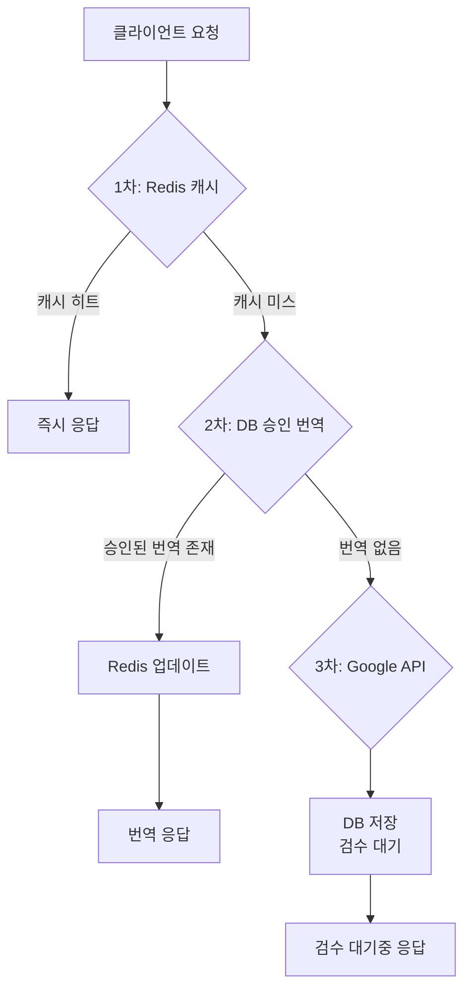

# 번역 시스템 3단계 처리 프로세스

## 개요

Hana Lang Connect의 번역 시스템은 효율적인 3-tier 캐싱 전략을 사용하여 번역 성능을 최적화하고 비용을 절감합니다.

## 시스템 아키텍처



## 상세 처리 과정

### 1차 처리: Redis 캐시 조회

**목적**: 가장 빠른 응답 제공

#### 처리 흐름

1. 캐시 키 생성: `SHA256(원본텍스트:타겟언어)`
2. Redis에서 번역 결과 조회
3. 캐시 히트 시 즉시 반환

#### Redis 저장 구조

```json
{
  "originalText": "안녕하세요",
  "translatedText": "Hello",
  "targetLang": "en",
  "timestamp": 1699123456
}
```

#### 특징

- **TTL**: 무제한 (만료 없음)
- **저장 시점**: 승인된 번역만 저장
- **제외 데이터**: elementContext, sourceLang (최소화된 구조)

### 2차 처리: DB 승인 번역 조회

**목적**: 검수 완료된 고품질 번역 제공

#### SQL 쿼리 (sqlc)

```sql
-- name: GetApprovedTranslation :one
SELECT td.translated_text, td.element_context
FROM translation_data td
JOIN translation_reviews tr ON td.id = tr.translation_id
WHERE md5(td.source_text) = md5(sqlc.arg(source_text)::text)
AND td.target_language = sqlc.arg(target_language)
AND tr.review_status = 'approved'
LIMIT 1;
```

#### 처리 흐름

1. DB에서 승인된(approved) 번역 조회
2. 번역 발견 시:
   - Redis 캐시 업데이트
   - 클라이언트에 번역 반환
3. element_context는 요청 시 제공된 것 사용

#### 응답 예시

```json
{
  "message": "Translation successful (approved)",
  "code": 200,
  "data": {
    "originalText": "안녕하세요",
    "translatedText": "Hello",
    "sourceLang": "ko",
    "targetLang": "en",
    "elementContext": {
      /* 클라이언트 제공 컨텍스트 */
    }
  }
}
```

### 3차 처리: Google Translate API 호출

**목적**: 신규 번역 생성 및 검수 대기 등록

#### 처리 흐름

1. Google Translate API 호출
2. 번역 결과 DB 저장 (트랜잭션 처리)
   - `translation_data` 테이블에 번역 저장
   - `translation_reviews` 테이블에 'pending' 상태로 등록
3. **Redis 캐시 저장 안함** (승인 전까지)
4. 클라이언트에 "⏳ 번역 검수 대기" 응답

#### DB 저장 구조

##### translation_data 테이블

```sql
INSERT INTO translation_data (
    source_text,           -- 원본 텍스트
    target_language,       -- 타겟 언어
    translated_text,       -- Google API 번역 결과
    translation_engine,    -- 'google'
    redis_key,            -- 캐시 키
    element_context       -- JSONB 형식의 컨텍스트
)
```

##### translation_reviews 테이블

```sql
INSERT INTO translation_reviews (
    translation_id,    -- translation_data.id
    review_status,     -- 'pending'
    priority          -- 3 (기본값)
)
```

#### 응답 예시

```json
{
  "message": "Translation pending review",
  "code": 200,
  "data": {
    "originalText": "안녕하세요",
    "translatedText": "⏳ 번역 검수 대기",
    "sourceLang": "ko",
    "targetLang": "en",
    "elementContext": {
      /* 클라이언트 제공 컨텍스트 */
    }
  }
}
```

## Element Context 구조

클라이언트에서 전송하는 상세 컨텍스트 정보:

```javascript
{
  // Node 정보
  "nodeType": 3,
  "nodeName": "#text",
  "textContent": "안녕하세요",
  "nodeValue": "안녕하세요",
  "textLength": 5,
  "wholeText": "안녕하세요",

  // Parent Element 정보
  "parentElement": {
    "tagName": "P",
    "className": "intro-text",
    "id": "welcome",
    "innerHTML": "<span>안녕하세요</span>..."
  },

  // Sibling 정보
  "previousSibling": "SPAN",
  "nextSibling": "#text",

  // Page Location 정보
  "location": {
    "href": "https://example.com/home",
    "origin": "https://example.com",
    "protocol": "https:",
    "host": "example.com",
    "hostname": "example.com",
    "port": null,
    "pathname": "/home",
    "search": "?lang=ko",
    "hash": "#welcome"
  }
}
```

## 검수 워크플로우

### Review Status 상태

- `pending`: 검수 대기
- `external_review`: 1차 외부 협력업체 검수 중
- `internal_review`: 2차 하나은행 내부 검수 중
- `approved`: 검수 완료 (승인) ✅
- `rejected`: 검수 반려
- `revision_required`: 수정 요청

### 승인 프로세스

1. Google API 번역 → `pending` 상태
2. 외부 검수자 검토 → `external_review`
3. 내부 검수자 검토 → `internal_review`
4. 최종 승인 → `approved` ✅
5. **승인 시 Redis 캐시 자동 갱신**

## 성능 최적화

### 캐시 전략

- **Redis 우선**: 가장 빠른 응답 (< 10ms)
- **DB 차선책**: 검증된 번역 제공 (< 50ms)
- **API 최후 수단**: 새로운 번역 생성 (> 200ms)

### 비용 절감

- 중복 Google API 호출 방지
- 승인된 번역 재사용
- Redis 영구 캐싱으로 DB 부하 감소

### 품질 관리

- 모든 신규 번역 검수 필수
- 검수 완료 번역만 Redis 캐싱
- Element Context로 번역 정확도 향상

## 구현 기술

### Backend

- **언어**: Go
- **프레임워크**: Gin
- **DB 라이브러리**: sqlc (타입 세이프 SQL)
- **캐시**: Redis
- **번역 API**: Google Translate API

### Database

- **PostgreSQL**: 메인 데이터 저장소
- **JSONB**: Element Context 저장
- **인덱스**: md5(source_text), target_language

### Frontend

- **React Hook**: useAutoTranslation
- **Context 수집**: DOM 노드 정보 자동 수집
- **API 통신**: Fetch API

## 에러 처리

### Redis 장애

- DB 직접 조회로 자동 전환
- 로그 기록 및 모니터링 알림

### DB 장애

- 트랜잭션 롤백
- 에러 응답 반환
- 재시도 로직 없음 (클라이언트 재요청 필요)

### Google API 장애

- "⏳ 번역 검수 대기" 응답
- 백그라운드 재시도 없음
- API 키 없을 시 Mock 응답

## 모니터링 포인트

1. **Redis 히트율**: 목표 > 90%
2. **DB 승인 번역 비율**: 목표 > 70%
3. **Google API 호출 횟수**: 비용 모니터링
4. **평균 응답 시간**: < 100ms 목표
5. **검수 대기 큐 길이**: SLA 관리

## 향후 개선 사항

1. **배치 번역**: 여러 텍스트 동시 처리
2. **언어별 캐시 전략**: 언어별 TTL 차별화
3. **자동 검수**: AI 기반 품질 평가
4. **실시간 검수 알림**: WebSocket 활용
5. **번역 메모리**: 유사 번역 제안
